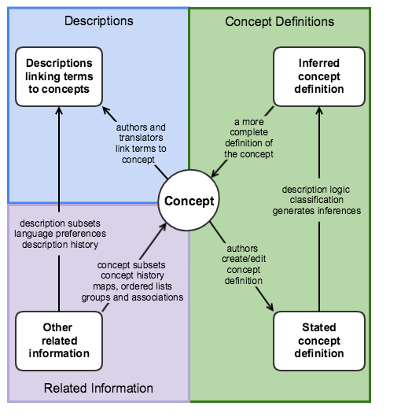

# 2.1 High Level Logical Model of SNOMED CT

[Figure 2.1-1](https://confluence.ihtsdotools.org/display/DOCRELFMT/2.1+High+Level+Logical+Model+of+SNOMED+CT#Figure-high-level "High-level abstract view of the design of SNOMED CT") provides a high-level view that illustrates the concept-centric design of [SNOMED CT](https://confluence.ihtsdotools.org/display/DOCGLOSS/SNOMED+CT "Glossary link: SNOMED CT"). The subsections below describe the different elements illustrated here.

<figure><figcaption>
Figure 2.1-1: High-level abstract view of the design of SNOMED CT
</figcaption></figure>

## Concepts

A [concept](https://confluence.ihtsdotools.org/display/DOCGLOSS/concept "Glossary link: concept") is defined as  a clinical idea to which a unique [concept identifier](https://confluence.ihtsdotools.org/display/DOCGLOSS/concept+identifier "Glossary link: concept identifier") has been assigned.

### Notes

  *  _SNOMED CT concepts_ are distributed in the [concept file](https://confluence.ihtsdotools.org/display/DOCGLOSS/concept+file "Glossary link: concept file").
  * _Concepts_ are associated with [descriptions](https://confluence.ihtsdotools.org/display/DOCGLOSS/description "Glossary link: descriptions") that contain human-readable [terms](https://confluence.ihtsdotools.org/display/DOCGLOSS/term "Glossary link: terms") describing the concept.

  * _Concepts_ are related to one another by [relationships](https://confluence.ihtsdotools.org/display/DOCGLOSS/relationship "Glossary link: relationships") and [OWL axioms](https://confluence.ihtsdotools.org/display/DOCGLOSS/OWL+axiom "Glossary link: OWL axioms") that provide a formal logical definition of the _concept_.

Authors create a new [SNOMED CT concept](https://confluence.ihtsdotools.org/display/DOCGLOSS/SNOMED+CT+concept "Glossary link: SNOMED CT concept") for each distinct clinical meaning added to the terminology. Every [concept](https://confluence.ihtsdotools.org/display/DOCGLOSS/concept "Glossary link: concept") is uniquely identified and this identifier allows the concept to be unambiguously recorded in a clinical record. The concept identifier also allow other related information to be linked to a specific concept. This linked information includes human-readable terms and formal concept definitions. 

## Descriptions

A [description](https://confluence.ihtsdotools.org/display/DOCGLOSS/description "Glossary link: description") is defined as  an association between a human-readable phrase ([term](https://confluence.ihtsdotools.org/display/DOCGLOSS/term "Glossary link: term")) and a particular [SNOMED CT concept](https://confluence.ihtsdotools.org/display/DOCGLOSS/SNOMED+CT+concept "Glossary link: SNOMED CT concept"). 

### Notes

  * Each  _description_ is represented by a separate row in the [Description File](https://confluence.ihtsdotools.org/display/DOCRELFMT/4.2.2.+Description+File+Specification).
  * Each _description_ has a unique [identifier](https://confluence.ihtsdotools.org/display/DOCGLOSS/identifier "Glossary link: identifier") and connects a [concept](https://confluence.ihtsdotools.org/display/DOCGLOSS/concept "Glossary link: concept") with a  _term_ of a specified [description type](https://confluence.ihtsdotools.org/display/DOCGLOSS/description+type "Glossary link: description type"). All concepts have descriptions with description types [fully specified name](https://confluence.ihtsdotools.org/display/DOCGLOSS/fully+specified+name "Glossary link: fully specified name") and [synonym](https://confluence.ihtsdotools.org/display/DOCGLOSS/synonym "Glossary link: synonym"). Other [description type](https://confluence.ihtsdotools.org/display/DOCGLOSS/description+type "Glossary link: description type") can be defined and may be applied to some [concepts](https://confluence.ihtsdotools.org/display/DOCGLOSS/concept "Glossary link: concepts").

Terminology authors create a set of [descriptions](https://confluence.ihtsdotools.org/display/DOCGLOSS/description "Glossary link: descriptions") each of which links a term to an identified concept. The linked terms must all be legitimate ways to label or refer to the concept to which they are linked. Translators also create [descriptions](https://confluence.ihtsdotools.org/display/DOCGLOSS/description "Glossary link: descriptions") to link appropriate terms in other languages or dialects to the same [concepts](https://confluence.ihtsdotools.org/display/DOCGLOSS/concept "Glossary link: concepts"). Since usage of terms varies depending on languages and dialects, the design also support addition of information about which descriptions contain terms that are preferred or acceptable in each language or dialect.

## Concept Definitions

Terminology authors associate each [concept](https://confluence.ihtsdotools.org/display/DOCGLOSS/concept "Glossary link: concept") with a formal stated definition. This stated concept definition consists of [description logic](https://confluence.ihtsdotools.org/display/DOCGLOSS/description+logic "Glossary link: description logic") axioms that are known to be true for that concept (for example stating that appendectomy is a procedure that applies the method excision to the appendix structure). Because these axioms are stated in a formal way, a [description logic classifier](https://confluence.ihtsdotools.org/display/DOCGLOSS/description+logic+classifier "Glossary link: description logic classifier") can be applied to all the axioms in the terminology to generate additional logical inferences. Therefore, the overall model is designed to enable representation of both the original stated concept definition and the inferred view of the concept definition.

In practice, a [description logic classifier](https://confluence.ihtsdotools.org/display/DOCGLOSS/description+logic+classifier "Glossary link: description logic classifier") can generate more than one inferred view, depending on whether all logically inferred axioms are retained and on whether some types of redundant axioms are omitted from the inferred view.

## Other Related Information

The SNOMED CT design also enables a wide range of customizable information to be linked to the concepts and descriptions mentioned above. The extensible design of SNOMED CT enables consistent representation and distribution of: 

  * subsets of concepts or descriptions
  * ordered lists of concepts or descriptions
  * language preferences associated with different descriptions
  * ordered or unordered associations between concepts
  * coded or plain text annotations linked to specific concepts
  * maps from concepts to codes in other code systems
  * representation of queries and expressions

