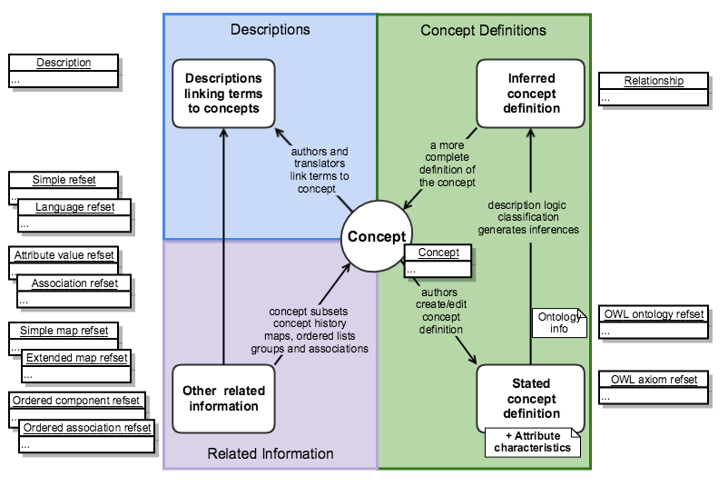

# Representation of the Logical Model

Figure 2.2-1 shows how SNOMED CT release files represent the logical model.

<figure><figcaption>
Figure 2.2-1: Representation of the logical model of SNOMED CT
</figcaption></figure>

Table 2.2-1: Release file representation of the logical model

<table data-header-hidden><thead><tr><th></th><th width="374.703125"></th><th width="171.0234375"></th></tr></thead><tbody><tr><td><strong>Logical Model</strong></td><td><strong>Release File Representations</strong></td><td><strong>References</strong></td></tr><tr><td><strong>Concepts</strong></td><td>Each concept is represented by a row in the concept release file.</td><td><a href="../4 component-release-files-specification/4.2 file-format-specifications/4.2.1-concept-file-specification.md">Concept File Specification</a></td></tr><tr><td><strong>Descriptions</strong></td><td>Each description is represented by a row in the description release file.</td><td><a href="../4 component-release-files-specification/4.2 file-format-specifications/4.2.2 description-file-specification/">Description File Specification</a></td></tr><tr><td><strong>Stated Concept Definitions</strong></td><td>
Each stated concept definition is represented by a set of rows in the OWL axiom reference set file, which follows the format of an OWL Expression Reference Set. Each row contains an axiom that forms part of the definition of the concept identified by the referencedComponentId.

<strong>Notes:</strong> 
<ul><li>As well as representing the definitions of individual concepts, the OWL axiom reference set represents characteristics of attributes including transitivity, reflexivity and property chains.</li><li>The OWL Ontology Reference Set also follows the OWL Expression Reference Set pattern. It contains general information about the terminology, which is required by a description logic classifier but is not subject to significant changes between release versions.</li></ul>
<strong>Change Note</strong>

This representation was introduced in July 2018 and, following a transitional period, now fully represents all stated concept definitions.
</td><td>
<a href="../appendixes/appendix-b.-specification-reference-information/o/owl-expression-reference-set-file.md">OWL Expression Reference Set</a>

<a href="https://app.gitbook.com/o/h8Z6qGxuQrzM9vbx5bPT/s/UVgNFMSypqSsi48DpFEe/">SNOMED CT OWL Guide</a>

<a href="https://app.gitbook.com/o/h8Z6qGxuQrzM9vbx5bPT/s/hRUJsLa2ant5L63pkp1O/">SNOMED CT Logic Profile Specification</a>
</td></tr><tr><td><strong>Inferred Concept Definitions</strong></td><td>Each inferred concept definition is represented by a set of rows in the relationship release file. Each row in the set that defines a concept, represents a necessary, defining relationship with another concept. The definitionStatusId column in the concept file row indicates whether the set of defining relationships is sufficient to define the concept.</td><td><a href="../4 component-release-files-specification/4.2 file-format-specifications/4.2.3-relationship-file-specification.md">Relationship File Specification</a></td></tr><tr><td><strong>Other Related Information</strong></td><td>
Represented by a range of reference set release files that conform to the extensible reference set file format.

Each row in a reference set refers to a concept or description as a member of the set.The extensible structure allows different types of related information to be associated with the referenced component.
</td><td>
<a href="../5 reference-set-release-files-specification/5.2 reference-set-types/">Reference Set Types</a>

<a href="https://app.gitbook.com/o/h8Z6qGxuQrzM9vbx5bPT/s/qOI2v58ZsXOoklmwBOk4/">SNOMED CT Reference Set Guide</a>
</td></tr></tbody></table>


Prior to July 2018 the stated view of concept definitions were represented by relationships in the stated relationship file. During a transitional period between July 2018 and July 2019 the OWL reference sets were introduced. Since the end of that transitional period in July 2019, the stated relationship file is no longer maintained or distributed.\
The representation of the inferred view of concept definitions is unchanged from the perspective of the release file structure. However, the nature and quality of the inferred relationships changed as a result of inferences derived from the enhanced definitions represented as axioms in the OWL axiom reference set.\
More information on these changes is available in this document in Section [OWL Expression Reference Set](<../5 reference-set-release-files-specification/5.2 reference-set-types/5.2.1 content-reference-sets/5.2.1.9-owl-expression-reference-set.md>) and a historical note on [Representation of the Logical Model - Before July 2018](../appendixes/appendix-a-notes-on-release-file-changes/representation-of-the-logical-model-before-july-2018.md). Detailed information about the representation of SNOMED CT definitions using OWL axioms is provided by the [SNOMED CT OWL Guide](https://app.gitbook.com/o/h8Z6qGxuQrzM9vbx5bPT/s/UVgNFMSypqSsi48DpFEe/) and [SNOMED CT Logic Profile Specification](https://app.gitbook.com/o/h8Z6qGxuQrzM9vbx5bPT/s/hRUJsLa2ant5L63pkp1O/).


