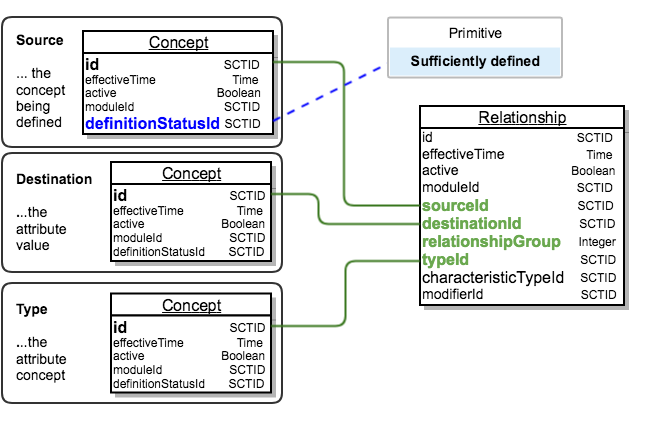

# Concept Definitions Represented as Relationships


**Glossary Definition**

A defining relationship is a relationship to a target concept that is always necessarily true for any instance of the source concept.

**Notes**

All _defining relationships_ represent necessary conditions.  However, some necessary conditions that can be represented by OWL Axioms cannot be represented by _relationships_.

**Example**

The _defining relationships_ of the concept [53442002 | Excision of stomach structure (procedure)|](https://browser.ihtsdotools.org/?perspective=full\&conceptId1=53442002\&edition=MAIN/2025-07-01\&release=\&languages=en\&latestRedirect=false) include

* 260686004 <mark style="color:blue;">|</mark>method<mark style="color:blue;">|</mark>  <mark style="color:red;">=</mark>  129304002 <mark style="color:blue;">|</mark>excision - action<mark style="color:blue;">|</mark>  and&#x20;
* 405813007 <mark style="color:blue;">|</mark>procedure site - Direct<mark style="color:blue;">|</mark>  <mark style="color:red;">=</mark>  69695003 <mark style="color:blue;">|</mark>stomach structure<mark style="color:blue;">|</mark>.



Between the first release of SNOMED CT in 2002 and 2018 both stated and inferred views of concept definitions were distributed as defining relationships in the stated relationship file and the relationship file.


As illustrated in Figure 2.3.4.1-1, each defining relationship is represented by a row in the relationship file. The concept being defined is referenced by the sourceId, the concept that represents the type of relationship (attribute) is referenced by the typeId and the destinationId refers to the concept that represents the value of that attribute.

The relationship file also has a relationshipGroup which allows two or more defining relationships to be grouped together.

The definitionStatusId of the source concept, indicates whether the combination of defining relationships provide provides sufficient definition of that concept.

<figure><figcaption>
Figure 2.3.4.1-1: Diagrammatic representation of use of relationships to represent a concept definition
</figcaption></figure>

***

**Table 2.3.4.1-1: Example of stated view of&#x20;**<mark style="color:blue;">**|**</mark>**Excision of stomach structure**<mark style="color:blue;">**|**</mark>**&#x20;represented by stated relationships**

<table data-header-hidden data-full-width="true"><thead><tr><th></th><th align="center"></th><th align="center"></th><th align="center"></th><th align="center"></th></tr></thead><tbody><tr><td><strong>sourceId</strong></td><td align="center"><strong>destinationId</strong></td><td align="center"><strong>relationship Group</strong></td><td align="center"><strong>typeId</strong></td><td align="center"><strong>characteristicTypesId</strong></td></tr><tr><td>53442002 <mark style="color:blue;">|</mark>Excision of stomach structure<mark style="color:blue;">|</mark></td><td align="center">
116680003 

<mark style="color:blue;">|</mark>Is a<mark style="color:blue;">|</mark>
</td><td align="center">0</td><td align="center">71388002 <mark style="color:blue;">|</mark>Procedure<mark style="color:blue;">|</mark></td><td align="center">900000000000010007 <mark style="color:blue;">|</mark>Stated relationship<mark style="color:blue;">|</mark></td></tr><tr><td>53442002 <mark style="color:blue;">|</mark>Excision of stomach structure<mark style="color:blue;">|</mark></td><td align="center">260686004 <mark style="color:blue;">|</mark>Method<mark style="color:blue;">|</mark></td><td align="center">1</td><td align="center">129304002 <mark style="color:blue;">|</mark>Excision - action<mark style="color:blue;">|</mark></td><td align="center">900000000000010007 <mark style="color:blue;">|</mark>Stated relationship<mark style="color:blue;">|</mark></td></tr><tr><td>53442002 <mark style="color:blue;">|</mark>Excision of stomach structure<mark style="color:blue;">|</mark></td><td align="center">405813007 <mark style="color:blue;">|</mark>Procedure site - Direct<mark style="color:blue;">|</mark></td><td align="center">1</td><td align="center">69695003 <mark style="color:blue;">|</mark>Stomach structure<mark style="color:blue;">|</mark></td><td align="center">900000000000010007 <mark style="color:blue;">|</mark>Stated relationship<mark style="color:blue;">|</mark></td></tr></tbody></table>

***


Table 2.3.4.1-1, shows the three rows in the relationship file that represent the definition of [53442002 |Excision of stomach structure|](http://snomed.info/id/53442002). As this is considered to be a sufficient definition of <mark style="color:blue;">|</mark>Excision of stomach structure<mark style="color:blue;">|</mark> the definitionStatusId of this concept is set to the value 900000000000073002 <mark style="color:blue;">|</mark>defined<mark style="color:blue;">|</mark>.



Some columns omitted: id, effectiveTime, active, moduleId and modifierId. Id columns are shown with the term expanded for clarity.


## Limitations of Relationships for Representing Concept Definitions

Section [Necessary Conditions and Sufficient Definitions](../2.3.2-necessary-conditions-and-sufficient-definitions.md), illustrated the following three points, which are not supported by the current use of relationships to represent concept definitions:

1. A concept may have more than one sufficient definition.
   * Use of relationships only supports representation of a single sufficient definition for each concept. If a concept is marked as sufficiently defined, all it relationships are considered to be part of its sufficient definition.
2. A concept may have a sufficient definition that includes some assertions that are not necessary conditions
   * Relationships are all assumed to be necessarily true.
3. Some necessary conditions may not be part of a sufficient definition.
   * Including these additional necessary conditions may cause some valid subtypes concepts (or expressions) to be omitted from the results of classification.

Section [Additional Logic Features](../2.3.3-additional-logic-features.md), identifies other useful features that are supported by description logic tools but cannot be represented using only SNOMED CT.

## Benefits of Relationships for Representing Concept Definitions

Relationships can be distributed in an easy to understand relational file structure. The relationship file has been an established part of the standard set of SNOMED CT release files since the first release in 2002, with a revision in 2011-2012 to use RF2 to enhance versioning capabilities. Relationships can be retrieved, displayed and processed using widely understood techniques such as SQL making it easy to join the relationships to the concepts to which they relate.

## Use of Relationships for Representing Concept Definitions

### Stated Relationships have been Deprecated

The stated view of concept definitions needed to be enhanced to allow more flexible and expressive use of description logic. The structure of the relationship file was not suitable for this and a decision was made to adopt the OWL Functional Syntax so that new DL features could be added over time. As a result, the stated relationship file was deprecated.

Information about the new representation for the stated view is included in section [Concept Definitions Represented in OWL](2.3.4.2-concept-definitions-represented-in-owl.md).


**Impact Assessment**

This change only impacted people who used the old stated view. Proper use of the stated view requires access to and use of a description logic classifier. Most DL classifiers require data to be provided in a OWL format, so these original users typically transformed from the stated relationship file to OWL prior to use. The new SNOMED CT OWL Toolkit makes it easy to prepare a full OWL file for classification from current and new distribution formats.

_Overall impact is therefore considered to be low, and outweighed by significant benefits._


### Relationships Used for Inferred View Only

The current relationship file continues to be released containing the inferred view. Due to limitations of the relationship file format, the inferred definitions do not contain the more sophisticated DL features. The relationship file:

* only contains necessary conditions
* does not distinguish between multiple sufficient definitions, regardless of whether each necessary condition is part of any of the sufficient definitions.

Nevertheless, the end result is still more complete and precise than the previous content of this file. The reason for this is that the inferred relationships in the file is generated by processing the enhanced stated view. Details of the way the inferred relationships are generated from the stated view are documented in [Generating Necessary Normal Form Relationships from the OWL Refsets](https://app.gitbook.com/s/UVgNFMSypqSsi48DpFEe/design-considerations/2.5-generating-necessary-normal-form-relationships-from-the-owl-refsets).


**Impact Assessment**

The limitation of this format should not impact the vast majority of users of this file. The inferred relationship file continues to support subsumption testing of precoordinated concepts. The inferred relationship file, however, no longer supports the testing of subsumption of postcoordinated expressions. Accurate tests for subsumption of postcoordinated expressions will be possible using a DL classifier with the stated OWL axioms. Optimizations such as the use of preclassified expression repositories can still be used to assist run time subsumption testing.

_Overall impact is considered to be low, and outweighed by significant benefits._

