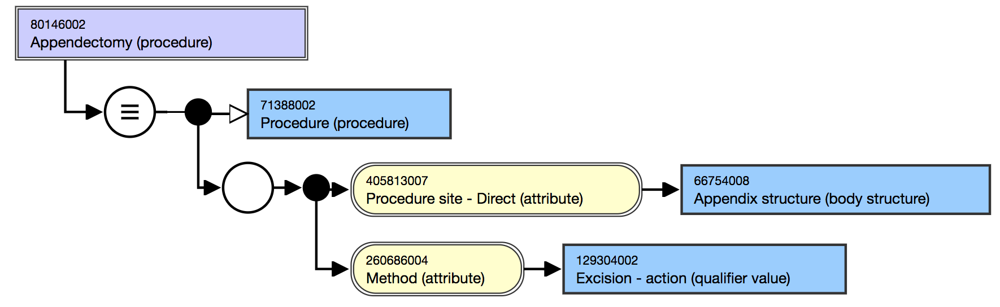
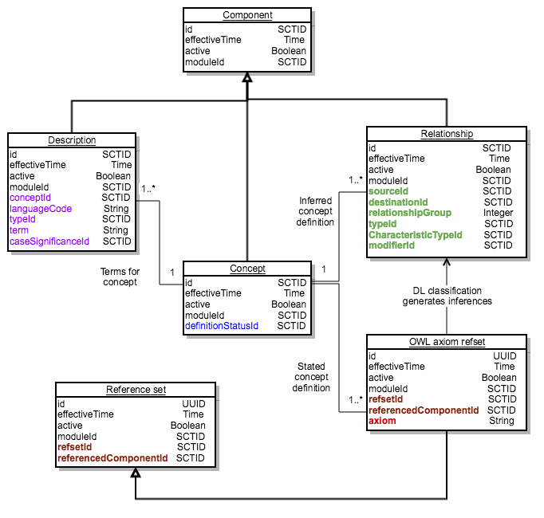

# 2.3.4.2 Concept Definitions Represented in OWL

This section outlines the rationale for distributing an OWL representation of the [stated view](https://confluence.ihtsdotools.org/display/DOCGLOSS/stated+view "Glossary link: stated view") of [concept definitions](https://confluence.ihtsdotools.org/display/DOCGLOSS/concept+definition "Glossary link: concept definitions") and provides an overview of the way OWL axioms are represented in [SNOMED CT release files](https://confluence.ihtsdotools.org/display/DOCGLOSS/SNOMED+CT+release+file "Glossary link: SNOMED CT release files"). More detailed information is published separately in the [SNOMED CT OWL Guide](https://confluence.ihtsdotools.org/display/DOCOWL) and the [SNOMED CT Logic Profile Specification](https://confluence.ihtsdotools.org/display/DOCLPS). 

# Rationale for Using OWL

The mismatch between the requirements for representing enhanced [concept definitions](https://confluence.ihtsdotools.org/display/DOCGLOSS/concept+definition "Glossary link: concept definitions") and the capabilities of the current [stated relationship file](https://confluence.ihtsdotools.org/display/DOCRELFMT/stated+relationship+file "Reference term: stated relationship file") might in theory be addressed by addition of columns to the file or adding additional information in reference sets. However, in practice this would create a more complex solution able to support a specific set of enhanced features. 

Adopting the well-established OWL standards formats offers a more flexible solution that can represent the full range of [description logic](https://confluence.ihtsdotools.org/display/DOCGLOSS/description+logic "Glossary link: description logic") features. This approach enables [SNOMED Internation](https://confluence.ihtsdotools.org/display/DOCGLOSS/SNOMED+Internation "Glossary link: SNOMED Internation") to specify a particular logic profile to be applied to current releases of [SNOMED CT](https://confluence.ihtsdotools.org/display/DOCGLOSS/SNOMED+CT "Glossary link: SNOMED CT"), with the option to extend that profile in the future. Future revisions of the logic profile would not require a change in the distribution file structure provided these were supported by an OWL syntax. 

# OWL Axioms

OWL axioms can be represented using several different syntaxes. SNOMED International has chose the [OWL Functional Syntax](https://confluence.ihtsdotools.org/display/DOCGLOSS/OWL+Functional+Syntax "Glossary link: OWL Functional Syntax") as its standard representation. 

The [OWL Functional Syntax](https://confluence.ihtsdotools.org/display/DOCGLOSS/OWL+Functional+Syntax "Glossary link: OWL Functional Syntax") is  a formal representation of the web ontology language (_OWL_) as a simple text base syntax that is used as a bridge between the structural specification and various concrete syntaxes. 

# Related Links

  * [OWL Functional-Style Syntax Specification](https://www.w3.org/TR/owl2-syntax/#Functional-Style_Syntax)

# OWL Expression Axiom Set

OWL axioms are distributed in a [reference set](https://confluence.ihtsdotools.org/display/DOCRELFMT/reference+set+\(field\) "Reference term: reference set \(field\)") that follows the [OWL Expression Reference Set](5.2.1.9-OWL-Expression-Reference-Set_66486617.html) specification. The axiom itself is contained in a string field and the [concept](https://confluence.ihtsdotools.org/display/DOCGLOSS/concept "Glossary link: concept") whose definition it contributes to is referenced by the the [referencedComponentId](https://confluence.ihtsdotools.org/display/DOCRELFMT/referencedComponentId+\(field\) "Reference term: referencedComponentId \(field\)"). Although a single row in the reference set can provide a [sufficient definition](https://confluence.ihtsdotools.org/display/DOCGLOSS/sufficient+definition "Glossary link: sufficient definition"), the definition of a single concept can also include several axioms each represented by a row in the reference set. 

# Comparing Stated Relationships and OWL Axioms

  

<figure><figcaption>
Figure 2.3.4.2-1: Diagrammatic representation of the definition of appendectomy
</figcaption></figure>

[Figure 2.3.4.2-1](https://confluence.ihtsdotools.org/display/DOCRELFMT/2.3.4.2+Concept+Definitions+Represented+in+OWL#Figure-appendectomy-diagram "Diagrammatic representation of the definition of appendectomy") shows the diagrammatic representation of the [stated view](https://confluence.ihtsdotools.org/display/DOCGLOSS/stated+view "Glossary link: stated view") of the definition of [ 80146002 | Appendectomy|](http://snomed.info/id/80146002 "80146002 | Appendectomy |") . [Table 2.3.4.2-1](https://confluence.ihtsdotools.org/display/DOCRELFMT/2.3.4.2+Concept+Definitions+Represented+in+OWL#Table-appendectomy-stated-rels "Stated relationships and definition status for the concept appendectomy") shows the same definition as represented by three rows in the [stated relationship file](https://confluence.ihtsdotools.org/display/DOCRELFMT/stated+relationship+file "Reference term: stated relationship file") together with the [definitionStatusId](https://confluence.ihtsdotools.org/display/DOCRELFMT/definitionStatusId+\(field\) "Reference term: definitionStatusId \(field\)") in the [concept file](https://confluence.ihtsdotools.org/display/DOCRELFMT/concept+file "Reference term: concept file"). 

Table 2.3.4.2-1: Stated relationships and definition status for the concept appendectomy

**id**| **effectiveTime**| **active**| **..**| **definitionStatusId**  
---|---|---|---|---  
[ 80146002 | Appendectomy|](http://snomed.info/id/80146002 "80146002 | Appendectomy |") | 20020131| 1| ..|  [ 900000000000073002 | Sufficiently defined concept|](http://snomed.info/id/900000000000073002 "900000000000073002 | Sufficiently defined concept |")  
  
**id**| **effective Time**| **active**| **..**| **sourceId**| **destinationId**| **relationship Group**| **typeId**| **..**| **..**  
---|---|---|---|---|---|---|---|---|---  
..| 20180731| 1| ..|  [ 80146002 | Appendectomy|](http://snomed.info/id/80146002 "80146002 | Appendectomy |") |  [ 71388002 | Procedure|](http://snomed.info/id/71388002 "71388002 | Procedure |") | 0|  [ 116680003 | Is a|](http://snomed.info/id/116680003 "116680003 | Is a |") | ..| ..  
..| 20080731| 1| ..|  [ 80146002 | Appendectomy|](http://snomed.info/id/80146002 "80146002 | Appendectomy |") |  [ 129304002 | Excision - action|](http://snomed.info/id/129304002 "129304002 | Excision - action |") | 1|  [ 260686004 | Method|](http://snomed.info/id/260686004 "260686004 | Method |") | ..| ..  
..| 20080731| 1| ..|  [ 80146002 | Appendectomy|](http://snomed.info/id/80146002 "80146002 | Appendectomy |") |  [ 66754008 | Appendix structure|](http://snomed.info/id/66754008 "66754008 | Appendix structure |") | 1|  [ 405813007 | Procedure site - Direct|](http://snomed.info/id/405813007 "405813007 | Procedure site - Direct |") | ..| ..  
  
[Table 2.3.4.2-2](https://confluence.ihtsdotools.org/display/DOCRELFMT/2.3.4.2+Concept+Definitions+Represented+in+OWL#Table-appendectomy-owl-axiom "Example of OWL axiom refset representation of the definition of appendectomy") shows a row in the [OWL axiom reference set file](https://confluence.ihtsdotools.org/display/DOCRELFMT/OWL+axiom+reference+set+file "Reference term: OWL axiom reference set file") representing the same definition. As shown by this example, a single [sufficient definition](https://confluence.ihtsdotools.org/display/DOCGLOSS/sufficient+definition "Glossary link: sufficient definition") is represented by a single row in the reference set. However, some [concept definitions](https://confluence.ihtsdotools.org/display/DOCGLOSS/concept+definition "Glossary link: concept definitions") may require multiple rows in the reference set. Situations in which multiple row are required include: 

  * Concepts with multiple [sufficient definitions](https://confluence.ihtsdotools.org/display/DOCGLOSS/sufficient+definition "Glossary link: sufficient definitions"), each of which requires a separate row in the reference set. 
  * Concepts with additional [necessary conditions](https://confluence.ihtsdotools.org/display/DOCGLOSS/necessary+condition "Glossary link: necessary conditions") that are not part of a [sufficient definition](https://confluence.ihtsdotools.org/display/DOCGLOSS/sufficient+definition "Glossary link: sufficient definition"), each of which requires a separate row in the reference set. 

  

Table 2.3.4.2-2: Example of OWL axiom refset representation of the definition of appendectomy

**id**| **effective Time**| **active**| **moduleId**| **refsetId**| **referenceComponentId**| **owlExpression**  
---|---|---|---|---|---|---  
..| [1](https://confluence.ihtsdotools.org/display/DOCRELFMT/2.3.4.2+Concept+Definitions+Represented+in+OWL#Footnote1 "Footnote: Click here to display the footnote") | 1| ..|  [ 733073007 | OWL axiom reference set|](http://snomed.info/id/733073007 "733073007 | OWL axiom reference set |") |  [ 80146002 | Appendectomy|](http://snomed.info/id/80146002 "80146002 | Appendectomy |") | EquivalentClasses(:80146002 ObjectIntersectionOf(:71388002 ObjectSomeValuesFrom(:609096000 ObjectIntersectionOf(ObjectSomeValuesFrom(:260686004 :129304002) ObjectSomeValuesFrom(:405813007 :66754008)))))   
  

<figure></figure>

  

