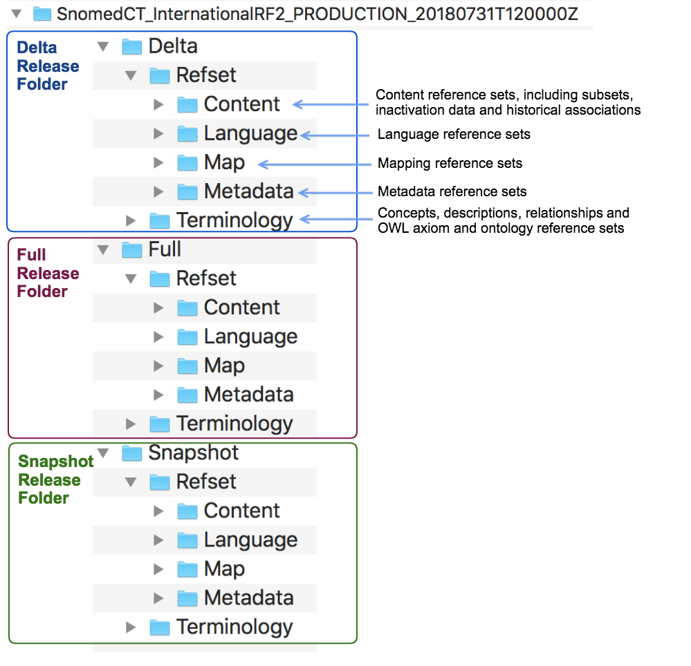
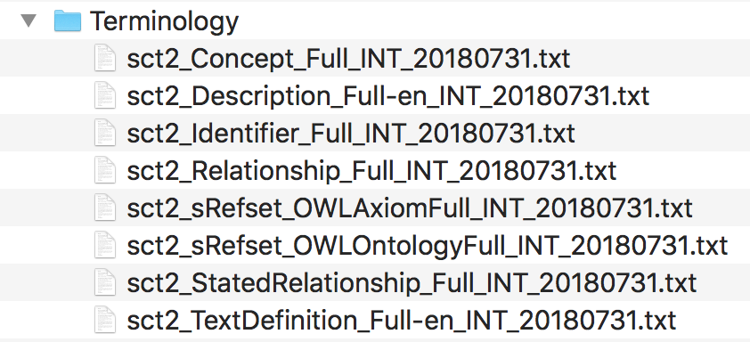
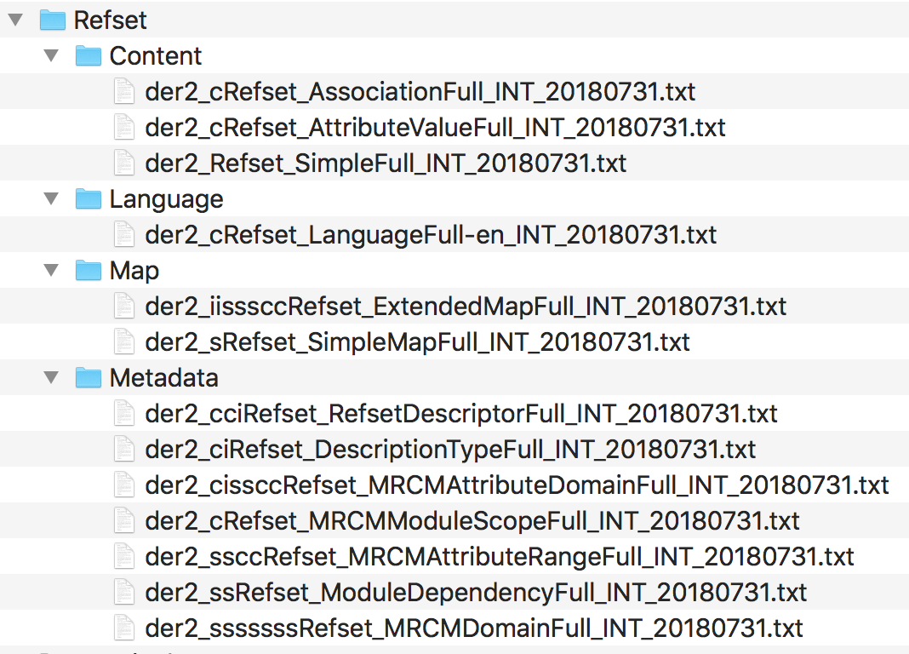

# Release Package Contents

This subsection provides illustrated notes on the contents of the SNOMED CT International release package used to distribute the SNOMED International Edition. Similar folder structures should be present in other release packages. However, the files included may be limited to those required to represent the components and/or reference set members in that particular release package.

Figure 3.4-1 shows the overall structure of a release package. The top level folder is named according to the Release Package Naming Conventions. It contains one subfolder for each of the Release Types (Delta, Full and Snapshot). Each release type folder contains a Terminology folder and a Refset folder. The Refset folders contains separate folders for different groups of reference sets (Content, Language, Map and Metadata).

<figure><figcaption>
Figure 3.4-1: Release package folder structure
</figcaption></figure>

Figure 3.4-2 shows the contents of the Terminology folder. In this case, the files shown are those for the Full release type. Details of most of these files are shown in section [Component Release Files Specification](<../4 component-release-files-specification/>), while the OWL refsets follow the specification of the [OWL Expression Reference Set](<../5 reference-set-release-files-specification/5.2 reference-set-types/5.2.1 content-reference-sets/5.2.1.9-owl-expression-reference-set.md>).


**Notes**

* The Identifier file contains no data in the International release and can be ignored.
* The Stated Relationship file will be deprecated at the end of a transition period that began in July 2018 and is scheduled to be completed in 2019.


<figure><figcaption>
Figure 3.4-2: Files in the Full/Terminology folder
</figcaption></figure>

The same file types are present in the other release type Terminology folders. However, the word "Full" in the filenames is replaced by the appropriate release type name ("Snapshot" or "Delta").

Figure 3.4-3 shows the contents of the Refset subfolders. In this case, the files shown are those for the Full release type. The names of the reference set files correspond the reference set types and the structure of each reference set type is specified in section [Reference Set Types](<../5 reference-set-release-files-specification/5.2 reference-set-types/>).


Other release packages may include different collections of reference sets to support the intended uses of that package. Similarly, subsequent releases of a package may include additional reference set files that support additional functionality.


<figure><figcaption>
Figure 3.4-3: Files in the Full/Refset folders
</figcaption></figure>

The same refset file types are present in the other release type Refset subfolders. However, the word "Full" in the filenames is replaced by the appropriate release type name ("Snapshot" or "Delta").
