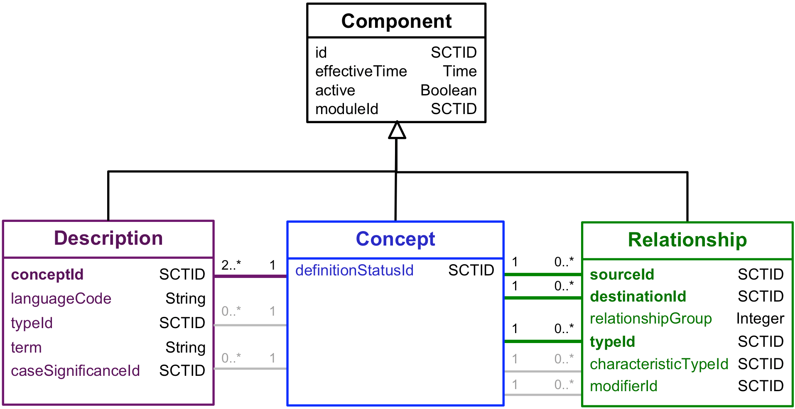
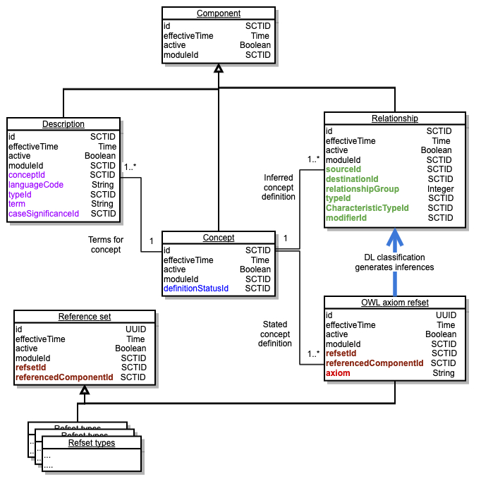

# Associations Between Release Files

## Associations between Component Files

The logical model of associations between the components in the release files is shown in Figure 4.1-1. The component class represents columns present in all three component files. The individual classes (description, concept and relationship) only show the additional columns present in those files. The colored lines between descriptions and concepts and between relationships and concepts represent the link between the foreign keys (shown in bold) and the id of the concept. These provide the functional connections between components described in this document. The grey lines indicate additional links between columns that are populated with concept identifiers that provide enumerated values.

<figure><figcaption>
Figure 4.1-1: Logical Relationships Between Component Files
</figcaption></figure>

## A More Complete View of Release File Associations

Figure 4.1-2 provides an extended view of the associations between release files following changes complete in July 2019 release of SNOMED CT1 . These changes enable SNOMED CT to use enhanced description logic features and resulted in a significant change to the way in which the stated view of concept definitions are represented. However the changes but did not significantly affect the structure and associations between the main component files shown in Figure 4.1-1

<figure><figcaption>
Figure 4.1-2: Associations between SNOMED CT Release Files
</figcaption></figure>

## Detailed Notes of Release File Associations

Each concept is represented by a row in the Concept and the concept is identified by the id column in that row. There can be more than one row with the same id but with different effectiveTime values, in which case each of these rows represents a version of that same concept. Thus each row represents a version of a clinical concept.

Each concept has two or more descriptions associated with it:

* At least one Fully Specified Name; and
* At least one synonym.

Each description is represented by a row in the description file and is identified by the id column in that row. There can be more than one row with the same id but with different effectiveTime values, in which case each of these rows represents a version of that same description. Thus each row represents a version of a description. Each description applies to one concept to which it is linked by the conceptId. All versions of a description must relate to exactly the same identified concept (i.e. the conceptId must not change between versions).

Each relationship, from a source concept to a destination concept, is represented by a row in the relationship file. There can be more than one row with the same id but with different effectiveTime values, in which case each of these rows represents a version of that same relationship. Thus each row represents a version of a relationship. The source, destination and type each relationship are identified respectively by the sourceId, destinationId and typeId columns. All versions of a relationship must have the same sourceId, destinationId and typeId. The typeId refers to concept, that is also held within the concept file. The only concepts that can be used as the relationship typeId are [116680003 | is a|](http://snomed.info/id/116680003) or concepts that are subtypes of [410662002 | Concept model attribute|](http://snomed.info/id/410662002) .

The most basic form of relationship is the <mark style="color:blue;">|</mark>is a<mark style="color:blue;">|</mark> relationship. This relationship states that one concept is a subtype of another concept. Each subtype concept is connected to its parent subtype(s) by relationships with the typeId 116680003 <mark style="color:blue;">|</mark>is a<mark style="color:blue;">|</mark> and this form the main SNOMED CT hierarchy. In this hierarchy, a child concept may have more than one parent concept. The root of the hierarchy is [138875005 | SNOMED CT Concept|](http://snomed.info/id/138875005) , which has a set of top level children, each forming its own sub-hierarchy.Relationships with typeid values that are subtypes of  <mark style="color:blue;">|</mark>Concept model attribute<mark style="color:blue;">|</mark> are referred to as attribute relationship and contribute to the formal definition of the source concept.


The associations shown on the page are the results of changes that occured between July 2018 and July 2019. For documentation file associations before these changes please refer to [Associations Between Release Files Prior to July 2018](../appendices/appendix-a-notes-on-release-file-changes/associations-between-release-files-prior-to-july-2018.md).

