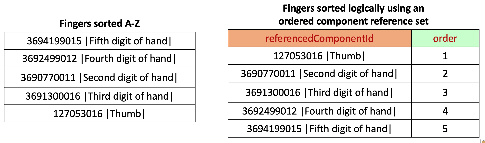

# Ordered Component Reference Set

## Purpose 

An [|Ordered component type reference set (foundation metadata concept)|](http://snomed.info/id/733619002) allows a collection of components to be defined with a specified order. This type of reference set is therefore useful for creating ordered lists and to specify groups where the components that belong to the same group share the same order.

## Data structure 

An Ordered component reference set (an Integer Component reference set) is used to represent ordered lists and alternative hierarchies. Its structure is shown in the following table.

***

**Ordered component reference set - Data structure**

<table data-full-width="true"><thead><tr><th width="208.015625">Field</th><th width="94.0859375">Data structure</th><th width="558.1430053710938">Purpose</th><th width="89.25390625">Mutable</th><th width="144.0390625">PK*</th></tr></thead><tbody><tr><td>id</td><td>UUID</td><td>
A 128 bit unsigned Integer, uniquely identifying this reference set member.

Different versions of a <em>reference set member</em> share the same id but have different effectiveTime. This allows a <em>reference set member</em> to be modified or made inactive (i.e. removed from the active set) at a specified time.
</td><td><mark style="color:$danger;"><strong>NO</strong></mark></td><td><mark style="color:$success;"><strong>YES</strong></mark>  (Full /Snapshot)</td></tr><tr><td>effectiveTime</td><td>Time</td><td>
The inclusive date or time at which this version of the identified reference set member became the current version.

<strong>Note</strong>: In distribution files the effectiveTime should follow the short ISO date format (<em>YYYYMMDD</em>) and should not include the hours, minutes, seconds or timezone indicator.

The current version of this reference set member at time <em>T</em> is the version with the most recent effectiveTime prior to or equal to time <em>T</em>.
</td><td><mark style="color:$success;"><strong>YES</strong></mark> </td><td>
<mark style="color:$success;"><strong>YES</strong></mark>  (Full)

<mark style="color:$success;">Optional</mark> (Snapshot) 
</td></tr><tr><td>active</td><td>Boolean</td><td>
The state of the identified reference set member as at the specified effectiveTime .

If active = 1 (true) the reference set member is part of the current version of the set, if active = 0 (false) the reference set member is not part of the current version of the set.
</td><td><mark style="color:$success;"><strong>YES</strong></mark> </td><td><mark style="color:$danger;"><strong>NO</strong></mark></td></tr><tr><td>moduleId</td><td>SCTID</td><td>
Identifies the SNOMED CT module that contains this reference set member as at the specified effectiveTime.

The value must be a subtype of <a href="http://snomed.info/id/900000000000443000">900000000000443000 |Module (core metadata concept)|</a> within the metadata hierarchy.
</td><td><mark style="color:$success;"><strong>YES</strong></mark> </td><td><mark style="color:$danger;"><strong>NO</strong></mark></td></tr><tr><td>refsetId</td><td>SCTID</td><td>
Identifies the reference set to which this reference set member belongs.

In this case, a subtype descendant of: <a href="http://snomed.info/id/733619002">733619002 |Ordered component type reference set (foundation metadata concept)|</a>
</td><td><mark style="color:$danger;"><strong>NO</strong></mark></td><td><mark style="color:$danger;"><strong>NO</strong></mark></td></tr><tr><td>referencedComponentId</td><td>SCTID</td><td>A reference to the SNOMED CT component to be included in the reference set.</td><td><mark style="color:$danger;"><strong>NO</strong></mark></td><td><mark style="color:$danger;"><strong>NO</strong></mark></td></tr><tr><td>order</td><td>Integer</td><td>
Specifies the sort order of the list. The list is ordered by applying an ascending sort of the order value.

The value of order =1 represents the highest priority. A value of '0' is not allowed. Duplicate values are permitted and the sort order between two members with the same order value is not defined.

Note: The name "order" is a reserved word in some database environments. Please consider this when using this column.
</td><td><mark style="color:$success;"><strong>YES</strong></mark> </td><td><mark style="color:$danger;"><strong>NO</strong></mark></td></tr></tbody></table>


PK\* indicates if the attribute is part of the primary key for that file/table.


***

## Metadata 

The following metadata in the "Foundation metadata concept" hierarchy supports this reference set:&#x20;

**Ordered Component Reference Sets in the Metadata Hierarchy**

> &#x20; [900000000000454005 |Foundation metadata concept|](http://snomed.info/id/900000000000454005)\
> &#x20;           [900000000000455006 |Reference set|](http://snomed.info/id/900000000000455006)\
> &#x20;                    [733619002 |Ordered component type reference set|](http://snomed.info/id/733619002)

***

## Reference Set Descriptor and Example Data 


**Notes on the tables used to show descriptors and examples**

The reference set example tables on this page have been revised as follows to aid clarity and understanding:

* The first four columns which are present in all release files are not shown. The omitted columns (id, effectiveTime, active, moduleId) are used in the same way in all referenced sets to support identification, versioning and packaging. They do not directly affect the specific features of a particular reference set or reference set type.
* Reference set columns that contain SNOMED CT identifiers are expanded to show details of the concept or description referenced by that identifier. In some cases, the term is shown in the same column using the expression syntax, in other cases an additional column with a name suffix '\_term' has been added. In the standard reference set files only the identifier is present in the column and there is no added column for the term. When using reference sets, the term and other details of the component are looked up from the relevant component release files.


#### Descriptor Template 

The tables below show the descriptor that defines the structure of the Ordered component type reference set pattern and an example of descriptor for a specific reference set that follows this pattern.

***

**Refset Descriptor rows for an ordered reference set**

<table data-full-width="true"><thead><tr><th width="213.1953125">refsetId</th><th width="250.2008056640625">referencedComponentId</th><th width="226.2086181640625">attributeDescription</th><th width="224.32501220703125">attributeType</th><th width="146.2890625">attributeOrder</th></tr></thead><tbody><tr><td><a href="http://snomed.info/id/900000000000456007"><mark style="color:$info;">900000000000456007</mark> |Reference set descriptor|</a>  </td><td><a href="http://snomed.info/id/733619002"><mark style="color:$info;">733619002</mark> </a><a href="http://snomed.info/id/733619002">|Ordered component type reference set|</a></td><td><a href="http://snomed.info/id/449608002"><mark style="color:$info;">449608002</mark> |Referenced component|</a></td><td><a href="http://snomed.info/id/900000000000460005"><mark style="color:$info;">900000000000460005</mark> |Component type|</a></td><td>0</td></tr><tr><td>  <a href="http://snomed.info/id/900000000000456007"><mark style="color:$info;">900000000000456007</mark> |Reference set descriptor|</a>  </td><td><a href="http://snomed.info/id/733619002"><mark style="color:$info;">733619002</mark> |Ordered component type reference set|</a></td><td><a href="http://snomed.info/id/447255006"><mark style="color:$info;">447255006</mark> |Priority order reference set attribute|</a></td><td><a href="http://snomed.info/id/900000000000478000"><mark style="color:$info;">900000000000478000</mark> |Unsigned integer|</a></td><td>1</td></tr></tbody></table>


Note: The table above omits the initial four columns of data present in the release file. These follow the standards versioning pattern id, effectiveTime, active, moduleId. Additionally, to aid understanding, the table above also shows the term from one of the descriptions associated with each of the identified concept. The release file only contains the identifier.


***

#### Ordered reference set example 

<figure><figcaption></figcaption></figure>

**Rational ordering of finger concepts using an ordered component reference set**

<table data-full-width="true"><thead><tr><th>refsetId</th><th>referencedComponentId</th><th>order (Attribute order)</th></tr></thead><tbody><tr><td>
733619002 

|Fingers ordered component reference set|

 
</td><td> <a href="http://snomed.info/id/127053016">127053016 |Thumb|</a></td><td>1</td></tr><tr><td>
733619002 

|Fingers ordered component reference set|
</td><td><a href="http://snomed.info/id/3690770011">3690770011 |Second digit of hand|</a> </td><td>2</td></tr><tr><td>
733619002 

|Fingers ordered component reference set| 

 
</td><td><a href="http://snomed.info/id/3691300016">3691300016 |Third digit of hand|</a> </td><td>3</td></tr><tr><td>
733619002 

|Fingers ordered component reference set| 

 
</td><td><a href="http://snomed.info/id/3692499012">3692499012 |Fourth digit of hand|</a> </td><td>4</td></tr><tr><td>
733619002 

|Fingers ordered component reference set|
</td><td><a href="http://snomed.info/id/3694199015">3694199015 |Fifth digit of hand|</a> </td><td>5</td></tr></tbody></table>
