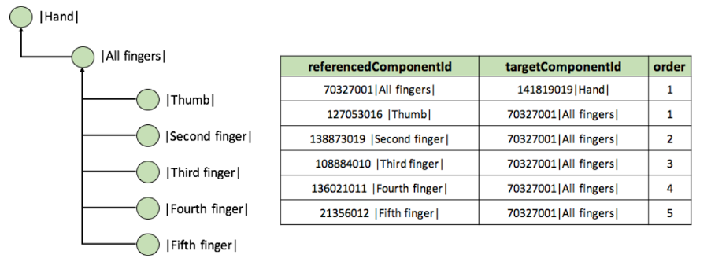

# Ordered Association Reference Set

## Purpose

An [733618005 | Ordered association type reference set (foundation metadata concept)|](http://snomed.info/id/733618005) can be used to specify ordered associations between different components. These can be used to specify several interrelated subsets of components and to define alternative hierarchies for navigation while searching for an appropriate concept or description.

## Data structure

An Ordered association reference set is a component integer reference set that is used to represent ordered lists of associations and alternative hierarchies. Its structure is shown in the following table.

***

**Table 5.2.1.5-1: Ordered association reference set - Data structure**

<table data-header-hidden data-full-width="true"><thead><tr><th width="208.56640625"></th><th width="99.15234375"></th><th width="538.0515747070312"></th><th width="89.484375"></th><th></th></tr></thead><tbody><tr><td><strong>Field</strong></td><td><strong>Data type</strong></td><td><strong>Purpose</strong></td><td><strong>Mutable</strong></td><td><strong>Part of Primary Key</strong></td></tr><tr><td>id</td><td>UUID</td><td>A 128 bit unsigned Integer, uniquely identifying this reference set member.Different versions of a <em>reference set member</em> share the same id but have different effectiveTime. This allows a <em>reference set member</em> to be modified or made inactive (i.e. removed from the active set) at a specified time.</td><td><mark style="color:$danger;"><strong>NO</strong></mark></td><td><mark style="color:$success;"><strong>YES</strong></mark> (Full/Snapshot)</td></tr><tr><td>effectiveTime</td><td>Time</td><td>
The inclusive date or time at which this version of the identified reference set member became the current version.

<strong>Note</strong> : In distribution files the effectiveTime should follow the short ISO date format (<em>YYYYMM DD</em>) and should not include the hours, minutes, seconds or timezone indicator.The current version of this reference set member at time <em>T</em> is the version with the most recent effectiveTime prior to or equal to time <em>T</em>.
</td><td><mark style="color:$success;"><strong>YES</strong></mark></td><td><mark style="color:$success;"><strong>YES</strong></mark>  (Full) <mark style="color:$success;">Optional</mark> (Snapshot)</td></tr><tr><td>active</td><td>Boolean</td><td>The state of the identified reference set member as at the specified effectiveTime. If active = 1 (true) the reference set member is part of the current version of the set, if active = 0 (false) the reference set member is not part of the current version of the set.</td><td><mark style="color:$success;"><strong>YES</strong></mark></td><td><mark style="color:$danger;"><strong>NO</strong></mark></td></tr><tr><td>moduleId</td><td>SCTID</td><td>
Identifies the SNOMED CT module that contains this reference set member as at the specified effectiveTime .

The value must be a subtype of <a href="http://snomed.info/id/900000000000443000">900000000000443000 |Module (core metadata concept)|</a> within the metadata hierarchy.
</td><td><mark style="color:$success;"><strong>YES</strong></mark></td><td><mark style="color:$danger;"><strong>NO</strong></mark></td></tr><tr><td>refsetId</td><td>SCTID</td><td>
Identifies the reference set to which this reference set member belongs.

A subtype descendant of:

<a href="http://snomed.info/id/447258008">447258008 |Ordered type reference set|</a>
</td><td><mark style="color:$danger;"><strong>NO</strong></mark></td><td><mark style="color:$danger;"><strong>NO</strong></mark></td></tr><tr><td>referencedComponentId</td><td>SCTID</td><td>A reference to the SNOMED CT component to be included in the reference set.</td><td><mark style="color:$danger;"><strong>NO</strong></mark></td><td><mark style="color:$danger;"><strong>NO</strong></mark></td></tr><tr><td>targetComponentId</td><td>SCTID</td><td>
The identifier of the target component of the association that acts as a grouper or hierarchy node, collecting together a subgroup from within the list.

This field either enables reference set member linked into a number of subgroups. These subgroups can be nested allowing representation of alternative hierarchies.

To link members into a subgroup, all components in the same subgroup should reference the same component. This can either be a component that represents the name of that subgroup or the first member of the subgroup. In the latter case, the first row of each subgroup will contain the same identifier in referencedComponentId and targetComponentId and with order =1.

To link a number of children concepts to a single parent concept, one member record should exist per child, with the referencedComponentId field referencing the parent and this field referencing the child concept. The order field is then used to order the children concepts under the parent concept.
</td><td><mark style="color:$success;"><strong>YES</strong></mark></td><td><mark style="color:$danger;"><strong>NO</strong></mark></td></tr><tr><td>order</td><td>integer</td><td>
Specifies the sort order of the list. The list is ordered by applying an ascending sort of the order value.

The value of order =1 represents the highest priority. A value of '0' is not allowed. Duplicate values are permitted and the sort order between two members with the same order value is not defined.

If the targetComponentId value is not 0, sorting occurs within subgroups that share the same targetComponentId.

Note: The name "order" is a reserved word in some database environments. Please consider this when using this column.
</td><td><mark style="color:$success;"><strong>YES</strong></mark></td><td><mark style="color:$danger;"><strong>NO</strong></mark></td></tr></tbody></table>

***

## Metadata

The following metadata in the "Foundation metadata concept" hierarchy supports this reference set:

**Table 5.2.1.5-2: Ordered Association References Set in the Metadata Hierarchy**

<table data-header-hidden data-full-width="false"><thead><tr><th></th></tr></thead><tbody><tr><td> <a href="http://snomed.info/id/900000000000454005">90000000000045</a><a href="http://snomed.info/id/900000000000454005">900000000000454005 |Foundation metadata concept|</a>          <a href="http://snomed.info/id/900000000000455006">900000000000455006 |Reference set|</a>                  <a href="http://snomed.info/id/733618005">733618005 |Ordered association type reference set (foundation metadata concept)|</a></td></tr></tbody></table>

***

## Reference Set Descriptor and Example Data


**Notes on the tables used to show descriptors and examples**

The reference set example tables on this page have been revised as follows to aid clarity and understanding:

* The first four columns which are present in all release files are not shown. The omitted columns ([id](https://confluence.ihtsdotools.org/display/DOCRELFMT/id+\(field\)), [effectiveTime](https://confluence.ihtsdotools.org/display/DOCRELFMT/effectiveTime+\(field\)), [active](https://confluence.ihtsdotools.org/display/DOCRELFMT/active+\(field\)), [moduleId](https://confluence.ihtsdotools.org/display/DOCRELFMT/moduleId+\(field\))) are used in the same way in all referenced sets to support identification, versioning and packaging. They do not directly affect the specific features of a particular reference set or reference set type.
* Reference set columns that contain SNOMED CT identifiers are expanded to show details of the concept or description referenced by that identifier. In some cases, the term is shown in the same column using the expression syntax, in other cases an additional column with a name suffix '\_term' has been added. In the standard reference set files only the identifier is present in the column and there is no added column for the term. When using reference sets, the term and other details of the component are looked up from the relevant component release files.


#### Descriptor Template

The tables below show the descriptor that defines the structure of the [447258008 | Ordered type reference set|](http://snomed.info/id/447258008) pattern and an example of descriptor for a specific reference set that follows this pattern.

***

**Table 5.2.1.5-3: Refset Descriptor rows for an ordered association type reference set**

<table data-header-hidden data-full-width="true"><thead><tr><th width="218.4320068359375" valign="top"></th><th width="395.710205078125" valign="middle"></th><th width="255.80157470703125"></th><th width="192.2906494140625"></th><th width="100"></th></tr></thead><tbody><tr><td valign="top"><strong>refsetId</strong></td><td valign="middle"><strong>referencedComponentId</strong> </td><td><strong>attributeDescription</strong> </td><td><strong>attributeType</strong> </td><td><strong>attributeOrder</strong> </td></tr><tr><td valign="top"><a href="http://snomed.info/id/900000000000456007">900000000000456007 |Reference set descriptor|</a></td><td valign="middle"><a href="http://snomed.info/id/733618005">733618005 | Ordered association type reference set (foundation metadata concept)|</a></td><td><a href="http://snomed.info/id/449608002">449608002 |Referenced component|</a></td><td><a href="http://snomed.info/id/900000000000460005">900000000000460005 |Component type|</a></td><td>0</td></tr><tr><td valign="top"><a href="http://snomed.info/id/900000000000456007">900000000000456007 |Reference set descriptor|</a></td><td valign="middle"><a href="http://snomed.info/id/733618005">733618005 | Ordered association type reference set (foundation metadata concept)|</a></td><td><a href="http://snomed.info/id/900000000000533001">900000000000533001 |Association target component|</a></td><td><a href="http://snomed.info/id/900000000000460005">900000000000460005 |Component type|</a></td><td>1</td></tr><tr><td valign="top"><a href="http://snomed.info/id/900000000000456007">900000000000456007 |Reference set descriptor|</a></td><td valign="middle"><a href="http://snomed.info/id/447258008">447258008 </a><a href="http://snomed.info/id/733618005">733618005 | Ordered association type reference set (foundation metadata concept)|</a></td><td><a href="http://snomed.info/id/447255006">447255006 |Priority order reference set attribute|</a></td><td><a href="http://snomed.info/id/900000000000478000">900000000000478000 |Unsigned integer|</a></td><td>2</td></tr></tbody></table>

***

### Example

[Ordered association reference sets](https://app.gitbook.com/s/qOI2v58ZsXOoklmwBOk4/5-reference-set-types) can be used to specify and display a customized navigation hierarchy. Alternative hierarchical representations of SNOMED CT can support data entry by satisfying the requirements of a specific use case, and addressing some of the challenges of displaying an unordered polyhierarchy (as defined by SNOMED CT's subtype structure).

The figure below shows the way a navigation hierarchy is represented. The example reference set contains a set of description components used to describe finger structures.

The <mark style="color:blue;">|</mark>All fingers<mark style="color:blue;">|</mark> components is linked to the <mark style="color:blue;">|</mark>Hand<mark style="color:blue;">|,</mark> and the <mark style="color:blue;">|</mark>Thumb<mark style="color:blue;">|</mark> is linked to the <mark style="color:blue;">|</mark>All fingers<mark style="color:blue;">|</mark> component<mark style="color:blue;">.</mark> The <mark style="color:blue;">|</mark>Thumb<mark style="color:blue;">|</mark> is placed first because it has the order value 1. Similarly, the components for <mark style="color:blue;">|</mark>Second finger<mark style="color:blue;">|</mark>, <mark style="color:blue;">|</mark>Third finger<mark style="color:blue;">|</mark>, <mark style="color:blue;">|</mark>Fourth finger<mark style="color:blue;">|</mark> and <mark style="color:blue;">|</mark>Fifth finger<mark style="color:blue;">|</mark> are also linked to the <mark style="color:blue;">|</mark>All finger<mark style="color:blue;">|</mark> component in the order specified by the order value. As shown in the figure the direction of the associations goes from the referenceComponentId to the targetComponentId so the components referenced by the targetComponentId are used to form the groups specified in the hierarchy

***

<table data-full-width="true"><thead><tr><th width="40.817169189453125">id</th><th width="109.1937255859375">effectiveTime</th><th width="63.6422119140625">active</th><th>moduleId</th><th width="135.3125">refsetId</th><th width="181.96875">refsetId_term</th><th width="115.01483154296875">referencedComponentId</th><th width="132.856201171875">referencedComponentId_term</th><th width="113.4351806640625">targetComponentId</th><th width="111.86090087890625">targetComponentId_term</th><th width="100">order</th></tr></thead><tbody><tr><td>…</td><td>20160731</td><td>1</td><td>19999999103</td><td>159999999105</td><td>Associations as ordered reference set</td><td>70327001</td><td>All fingers</td><td>141819019</td><td>Hand</td><td>1</td></tr><tr><td>…</td><td>20160731</td><td>1</td><td>19999999103</td><td>159999999105</td><td>Associations as ordered reference set</td><td>127053016</td><td>Thumb</td><td>70327001</td><td>All fingers</td><td>1</td></tr><tr><td>…</td><td>20160731</td><td>1</td><td>19999999103</td><td>159999999105</td><td>Associations as ordered reference set</td><td>138873019</td><td>Second finger</td><td>70327001</td><td>All fingers</td><td>2</td></tr><tr><td>…</td><td>20160731</td><td>1</td><td>19999999103</td><td>159999999105</td><td>Associations as ordered reference set</td><td>108884010</td><td>Third finger</td><td>70327001</td><td>All fingers</td><td>3</td></tr><tr><td>…</td><td>20160731</td><td>1</td><td>19999999103</td><td>159999999105</td><td>Associations as ordered reference set</td><td>136021011</td><td>Fourth finger</td><td>70327001</td><td>All fingers</td><td>4</td></tr><tr><td>…</td><td>20160731</td><td>1</td><td>19999999103</td><td>159999999105</td><td>Associations as ordered reference set</td><td>21356012</td><td>Fifth finger</td><td>70327001</td><td>All fingers</td><td>5</td></tr></tbody></table>

***

> **Figure 3.2.1.5-1: Navigation hierarchy example.**

<figure><figcaption></figcaption></figure>

