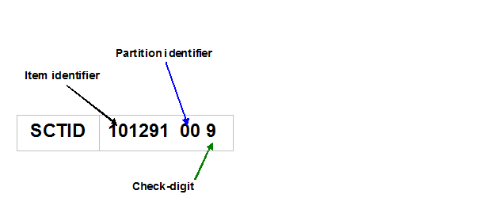
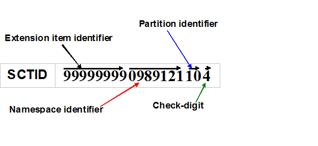

# 6.2 SCTID Representation

Each [SCTID](../appendices/appendix-b.-specification-reference-information/s/sctid-data-type.md) identifies a SNOMED CT component. The identifier itself does not contain information related to the meaning of a concept or description. This means it is not possible to infer anything about the meaning of a concept from the numeric value of the identifier or from the sequence of digits. The meaning of a concept can be determined from relationships to other concepts and from associated descriptions that include human readable terms.

The SCTID does however have a structure which includes valuable information about the nature and source of the identified component and the validity of the identifier. This structure supports the following features:

* Check-digit validation of the identifier.
  * The check-digit is the final digit in the decimal rendering of the identifier. This can be checked to minimize errors from transcription or incomplete copy-paste actions.
* Partitioning between identifiers for different types of [SNOMED CT component](https://confluence.ihtsdotools.org/display/DOCGLOSS/SNOMED+CT+component).
  * A two-digit partition identifier distinguishes the identifiers of different component types and prevents the same identifier from being allocated to both a concept and a description. As a result, when an SCTID is read from a record or other resource, it is possible to determine whether it represents a concept, a relationship or a description, before searching for the identified component.
* Namespaces to separate component identifiers originated by different organizations.
  * Organizations are only permitted to issue identifiers which fall within a specified namespace of potential identifier values. This prevents collisions between identifiers issues by different organizations which would otherwise result in ambiguity and errors when sharing data.
  * There are two formats used for representing namespaces.
    * Short format in which partition identifiers are reserved for an organization which is permitted to issue any valid identifiers within the allocated partitions. The short format approach does not require a specific namespace identifier and is only applicable to components originated and maintained by the SNOMED International as part of the International Release of SNOMED CT.
    * Long format in which the partition identifier value indicates that a separate namespace identifier is required to distinguish between components originated as part of an extension created by an appropriately authorized organization .

<figure><figcaption>
Figure 6.2-1: SCTID Short Format - Applicable to components originating from the International Release
</figcaption></figure>

<figure><figcaption>
Figure 6.2-2: SCTID Long Format - Applicable to components originating from a SNOMED CT Extension
</figcaption></figure>
