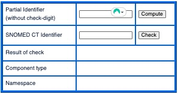

# SNOMED CT Identifier Check

The form below performs the SCTID Check-Digit computation and checking. It also identifies the namespace element of an identifier. Below the form is an expandable box including the JavaScript code used to perform these computations.

<figure><figcaption></figcaption></figure>

This Verhoeff checking part of this code was based on a webpage at:

* [http://www.augustana.ab.ca/\~mohrj/algorithms/checkdigit.html](http://www.augustana.ab.ca/~mohrj/algorithms/checkdigit.html)

The source HTML and JavaScript code for this form is shown in [Check-digit Computation](6.4.2-check-digit-computation.md).

\
