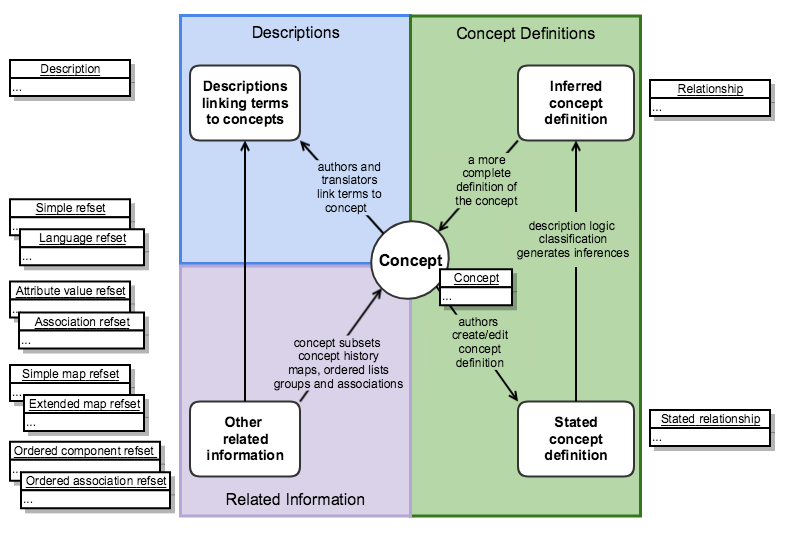

# Appendix A: Notes on Release File Changes

## Representation of the Logical Model - Before July 2018


This is a historical record of the representation of the SNOMED CT Logical Model before July 2018. During a period of transition between July 2018 and July 2019 the model was revised to enable more advanced description logic axioms to be represented. The Logical model following those changes is shown in [Representation of the Logical Model](<../2 snomed-ct-logical-model/2.2-representation-of-the-logical-model.md>)


The Figure below shows how SNOMED CT release files prior to July 2018 represented the various elements in the logical model. The revised representation of these elements are shown on in [Representation of the Logical Model](<../2 snomed-ct-logical-model/2.2-representation-of-the-logical-model.md>).

<figure><figcaption>
Practical representation of the logical model of SNOMED CT (before update)
</figcaption></figure>

***

**Release file representation of the logical model (before update)**

<table data-full-width="true"><thead><tr><th width="144.44183349609375">Logical Model</th><th width="610.8194580078125">Release File Representation</th><th>References</th></tr></thead><tbody><tr><td><strong>Concepts</strong></td><td>Each concept is represented by a row in the concept release file.</td><td><a href="../4 component-release-files-specification/4.2 file-format-specifications/4.2.1-concept-file-specification.md">Concept File Specification</a></td></tr><tr><td><strong>Descriptions</strong></td><td>Each description is represented by a row in the description release file.</td><td><a href="../4 component-release-files-specification/4.2 file-format-specifications/4.2.2 description-file-specification/">Description File Specification</a></td></tr><tr><td><strong>Stated Concept Definitions</strong></td><td>Each stated concept definition is represented by a set of rows in the stated relationship release file. Each row in the set that set defines a concept, represents a defining relationship with another concept. The definitionStatusId column in the concept file row indicates whether the set of defining relationships is sufficient to define the concept.The stated relationship file has the same format as the relationship file.</td><td><a href="../4 component-release-files-specification/4.2 file-format-specifications/4.2.3-relationship-file-specification.md">Relationship File Specification</a> <a href="appendix-b.-specification-reference-information/s/stated-relationship-file.md">Stated Relationship file</a></td></tr><tr><td><strong>Inferred Concept Definitions</strong></td><td>Each inferred concept definition is represented by a set of rows in the relationship release file. Each row in the set that set defines a concept, represents a defining relationship with another concept. The definitionStatusId column in the concept file row indicates whether the set of defining relationships is sufficient to define the concept.</td><td><a href="../4 component-release-files-specification/4.2 file-format-specifications/4.2.3-relationship-file-specification.md">Relationship File Specification</a> </td></tr><tr><td><strong>Other Related Information</strong></td><td>Represented by a range of reference set release files that conform to the extensible reference set file format. Each row in a reference set refers to a concept or description as a member of the set. The extensible structure allows different types of related information to be associated with the referenced component.</td><td>
<a href="../5 reference-set-release-files-specification/5.2 reference-set-types/">Reference Set Types</a>

<a href="https://app.gitbook.com/o/h8Z6qGxuQrzM9vbx5bPT/s/qOI2v58ZsXOoklmwBOk4/">Practical Guide to Reference Sets</a>
</td></tr></tbody></table>

## Associations Between Release Files Prior to July 2018


For details of the Stated Definition View since July 2019 please see [Associations Between Release Files](<../4 component-release-files-specification/4.1-associations-between-release-files.md>).


The [stated relationship file](appendix-b.-specification-reference-information/s/stated-relationship-file.md), was used to represent the stated view of relationships prior to a transition process between July 2018 and July 2019. In July 2019 this file became obsolete and was completely replaced by two [OWL Expression Reference Sets](<../5 reference-set-release-files-specification/5.2 reference-set-types/5.2.1 content-reference-sets/5.2.1.9-owl-expression-reference-set.md>) (the OWL axiom reference set file and the OWL ontology reference set file).

Figure 1 shows the associations between files that represent the stated and inferred views prior to the transition. It shows the associations between the release files that following these changes.

The stated relationship file is now obsolete as it has been completely replaced by two [OWL Expression Reference Sets](appendix-b.-specification-reference-information/o/owl-expression-reference-set-file.md) (the OWL axiom reference set file and the OWL ontology reference set file).

During the transitional period the stated relationship file continued to be distributed, but the OWL axiom reference set introduced advanced aspects to concept definitions which could not be represented in the stated relationship file.

<figure><figcaption>
Associations between SNOMED CT Release Files Prior to July 2019 (now obsolete)
</figcaption></figure>

## RF1 Compatibility and Conversion Tools

In January 2012 the SNOMED International switched from the original Release Format (used for SNOMED CT distribution since 2002), to the more flexible and consistent Release Format 2 (RF2). This means that from that date onward the primary source data for the SNOMED CT International Release is maintained and distributed in the RF2 format.

The SNOMED International recognizes that, while implementers will which to benefit from the features of the new format, there is inevitably a transitional period during which both format are in use. Therefore, the SNOMED International provides the following resources to support users whose system do not yet support SNOMED CT Release Format 2:

* Release Format 1 files will continue to be included in the International Release for a limited period
  * These files are not the authoritative version of SNOMED CT but are generated from the authoritative RF2 data using a software utility developed for this purpose.
  * The resulting RF1 data retains the functionality of the original release data but does not support any of the features of RF2. While all the clinically relevant SNOMED CT hierarchies are identical in both releases, the additional "Metadata Hierarchy" added as part of the RF2 upgrade is not included in the RF1 converted data. In addition there are some cases where Cross Maps
* The RF2 to RF1 Conversion Tool used for generating the RF1 files is also available to all Members and Affiliate Licensees
  * The "RF2 Conversion Tool" is an open source, Java-based, software tool to facilitate the conversion of SNOMED CT files released in RF2 format into RF1 format. The tool provides both a command line utility and a Graphical User Interface (GUI) to facilitate configuration, progress tracking and the maintenance of additional data whenever it is not available as part of an RF2 release.
  * The limitations of RF2 to RF1 conversion (noted above) will also apply to conversion undertaken using this tool. To enable the conversion to be completed successfully in a way that retains and replaces Identifiers consistently for the RF1 environment a set of auxiliary files (the "RF1 Compatibility Package") is also required.

The "RF2 to RF1 Conversion Tool" and the "RF1 Compatibility Package" are available for Members and Affiliates to download in the same way as the SNOMED CT International Release.


**Caution!**

These resources and tools are intended for use during a transitional period and should not be considered as a long term alternative to migration to support direct use of RF2 data within applications. As SNOMED CT continues to evolve more of the specific feature of RF2 will be used to add value to the terminology. Some of the added value delivered by RF2 is soon likely to be regarded as essential for effective solutions to user requirements.

