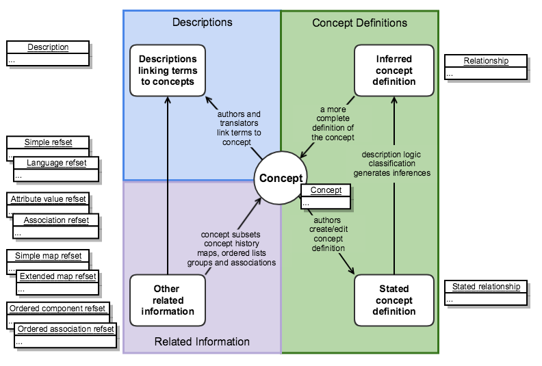

# Representation of the Logical Model - Before July 2018


This is a historical record of the representation of the SNOMED CT Logical Model before July 2018. During a period of transition between July 2018 and July 2019 the model was revised to enable more advanced description logic axioms to be represented. The Logical model following those changes is shown in [Representation of the Logical Model](../../../logical-model/2.2-representation-of-the-logical-model.md)


Figure 1 shows how SNOMED CT release files prior to July 2018 represented the various elements in the logical model. The revised representation of these element is shown on in [Representation of the Logical Model](../../../logical-model/2.2-representation-of-the-logical-model.md): Figure 1.

<figure><figcaption>
Figure 1: Practical representation of the logical model of SNOMED CT (before update)
</figcaption></figure>

Table 1: Release file representation of the logical model (before update)

<table data-header-hidden data-full-width="true"><thead><tr><th width="144.44183349609375"></th><th width="610.8194580078125"></th><th></th></tr></thead><tbody><tr><td><strong>Logical Model</strong></td><td><strong>Release File Representation</strong></td><td><strong>References</strong></td></tr><tr><td><strong>Concepts</strong></td><td>Each concept is represented by a row in the concept release file.</td><td><a href="../../../component-release-file-specification/4.2-file-format-specifications/4.2.1-concept-file-specification.md">Concept File Specification</a></td></tr><tr><td><strong>Descriptions</strong></td><td>Each description is represented by a row in the description release file.</td><td><a href="../../../component-release-file-specification/4.2-file-format-specifications/4.2.2-description-file-specification.md">Description File Specification</a></td></tr><tr><td><strong>Stated Concept Definitions</strong></td><td>Each stated concept definition is represented by a set of rows in the stated relationship release file. Each row in the set that set defines a concept, represents a defining relationship with another concept. The definitionStatusId column in the concept file row indicates whether the set of defining relationships is sufficient to define the concept.The stated relationship file has the same format as the relationship file.</td><td><a href="../../../component-release-file-specification/4.2-file-format-specifications/4.2.3-relationship-file-specification.md">Relationship File Specification</a> <a href="../../appendix-b.-specification-reference-information/s/stated-relationship-file.md">Stated Relationship file</a></td></tr><tr><td><strong>Inferred Concept Definitions</strong></td><td>Each inferred concept definition is represented by a set of rows in the relationship release file. Each row in the set that set defines a concept, represents a defining relationship with another concept. The definitionStatusId column in the concept file row indicates whether the set of defining relationships is sufficient to define the concept.</td><td><a href="../../../component-release-file-specification/4.2-file-format-specifications/4.2.3-relationship-file-specification.md">Relationship File Specification</a> </td></tr><tr><td><strong>Other Related Information</strong></td><td>Represented by a range of reference set release files that conform to the extensible reference set file format. Each row in a reference set refers to a concept or description as a member of the set. The extensible structure allows different types of related information to be associated with the referenced component.</td><td>
<a href="../../../reference-set-release-file-specification/5.2-reference-set-types/">Reference Set Types</a>

<a href="https://app.gitbook.com/o/h8Z6qGxuQrzM9vbx5bPT/s/qOI2v58ZsXOoklmwBOk4/">Practical Guide to Reference Sets</a>
</td></tr></tbody></table>
