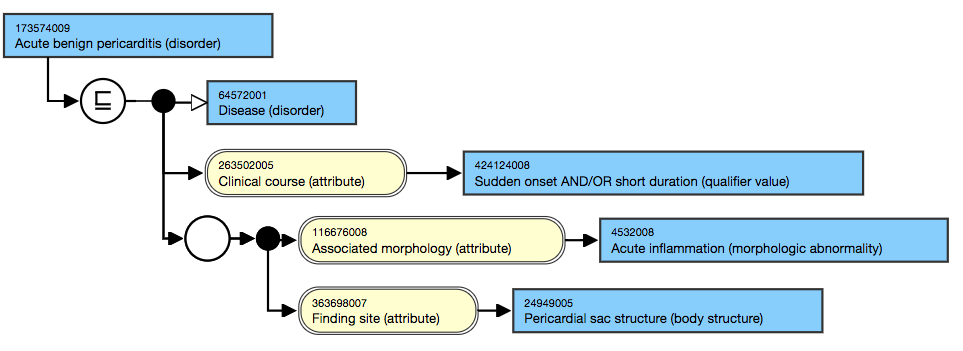

# Appendix D: Concept Definition Illustrations

A concept definition is a set of one or more axioms that partially or sufficiently specify the meaning of a SNOMED CT concept.

#### Notes

* _Concept definitions_ are represented in two ways in SNOMED CT release files:\
  \* As a stated view represented by axioms that conform to the OWL Functional Syntax distributed in the [OWL Expression Reference Set file](appendix-b.-specification-reference-information/o/owl-expression-reference-set-file.md).\
  \* As an inferred view represented by defining relationships that are distributed in the relationship file. The _inferred view_ is generated by applying description logic classification to the _stated view_.
* _Concept definitions_ include two distinct elements
  * Axioms that assert that a concept is a subtype of one or more other concepts. In the inferred view these are represented as subtype relationships.
  * Axioms that assert characteristics of a concept that distinguish it from its supertypes. In the inferred view these are represented as attribute relationships.

This appendix illustrates some of the features of concept definitions outlined in section [Concept Definitions](../2%20snomed-ct-logical-model/2.3%20concept-definitions).

***

## Stated and Inferred Definitions - Examples

The appendix contains an extended version of [Stated and Inferred Concept Definitions](<../2 snomed-ct-logical-model/2.3 concept-definitions/2.3.1-stated-and-inferred-concept-definitions.md>) supported by more detailed examples.

### Stated View of Concept Definitions

SNOMED CT concepts are defined by assertions made by SNOMED CT authors. The concept definitions asserted by SNOMED CT authors are known as the stated view.

The stated view is a representation of concept definitions consisting only of assertions made or revised by SNOMED CT authors.

#### Notes

* In contrast to the inferred view, the _stated view_ does not include inferences generated by applying a description logic classifier.
* The _stated view_ is represented by axioms, that conform to the OWL functional syntax. These axioms are distributed in the [OWL axiom reference set file](appendix-b.-specification-reference-information/o/owl-expression-reference-set-file.md).

### Description Logic Classification

A description logic classifier can apply logical rules to the stated view to create inferences. The end result of this process is an inferred view of concept definitions.

### Inferred Views of Concept Definitions

The inferred view is a representation of concept definitions that is logically derived by applying a description logic classifier to the stated view.

#### Notes

* Different _inferred views_ can be derived from the same stated view by applying different rules that selectively exclude some types of assertions.
* Different _inferred views_ may be semantically equivalent to one another provided that assertions are only excluded if they are redundant (i.e. can be _inferred_ from assertions that are included). However, in some cases, an _inferred view_ may not completely represent the concept definition but may serve a specific purpose.

### Illustration of the Effect of Classification

Table D.1-1 shows the stated view of the definitions of [710785000 |Laparoscopic repair of hernia|](http://snomed.info/id/710785000) . Compare this with the inferred view of the same concept in Table D.1-2 and you can see that the single supertype concept [71388002 |Procedure|](http://snomed.info/id/71388002) been replaced by four supertype concepts in the inferred view.

The classifier has compared the definition of [710785000 |Laparoscopic repair of hernia|](http://snomed.info/id/710785000) with the concept definitions shown in Tale D.1-3 and determined that [710785000 | Laparoscopic repair of hernia|](http://snomed.info/id/710785000) is a subtype of all these concepts.

In fact, the classifier will also have found several other supertypes but the inferred view distributed in the relationship file only includes proximal supertypes (parents). Other supertype ancestors are excluded from the file because they are redundant.1

**Stated view of the definition of&#x20;**<mark style="color:blue;">**|**</mark>**Laparoscopic repair of hernia**<mark style="color:blue;">**|**</mark>

<table data-full-width="true"><thead><tr><th width="230.28204345703125">Concept</th><th width="800">Stated View of Concept Definition</th></tr></thead><tbody><tr><td><a href="http://snomed.info/id/710785000">710785000 |Laparoscopic repair of hernia|</a></td><td>=== <a href="http://snomed.info/id/71388002">71388002 |Procedure|</a> : { <a href="http://snomed.info/id/363700003">363700003 |Direct morphology|</a> = <a href="http://snomed.info/id/414402003">414402003 |Hernial opening (morphologic abnormality)|</a> , <a href="http://snomed.info/id/425391005">425391005 |Using access device|</a> = <a href="http://snomed.info/id/86174004">86174004 |Laparoscope, device|</a> , <a href="http://snomed.info/id/260686004">260686004 |Method|</a> = <a href="http://snomed.info/id/257903006">257903006 |Repair - action|</a> }</td></tr></tbody></table>

***

**Inferred view of the definition of the concept&#x20;**<mark style="color:blue;">**|**</mark>**Laparoscopic repair of hernia**<mark style="color:blue;">**|**</mark>

<table data-full-width="true"><thead><tr><th width="236.19354248046875">Concept</th><th width="788.795166015625">Inferred View of Concept Definition</th></tr></thead><tbody><tr><td><a href="http://snomed.info/id/710785000">710785000 | Laparoscopic repair of hernia|</a></td><td>=== <a href="http://snomed.info/id/363321000">363321000 |Surgical repair procedure by device|</a> + <a href="http://snomed.info/id/50465008">50465008 |Hernia repair|</a> + <a href="http://snomed.info/id/51316009">51316009 |Laparoscopic procedure|</a> + <a href="http://snomed.info/id/264274002">264274002 |Endoscopic operation|</a> : { <a href="http://snomed.info/id/363700003">363700003 |Direct morphology|</a> = <a href="http://snomed.info/id/414402003">414402003 |Hernial opening (morphologic abnormality)|</a> , <a href="http://snomed.info/id/425391005">425391005 |Using access device|</a> = <a href="http://snomed.info/id/86174004">86174004 |Laparoscope, device|</a> , <a href="http://snomed.info/id/260686004">260686004 |Method|</a> = <a href="http://snomed.info/id/257903006">257903006 |Repair - action|</a> }</td></tr></tbody></table>

***

**Stated views of the four supertype concepts in the inferred&#x20;**<mark style="color:blue;">**|**</mark>**Laparoscopic repair of hernia**<mark style="color:blue;">**|**</mark>

<table data-full-width="true"><thead><tr><th width="265.00958251953125">Concept</th><th width="800">Stated View of Concept Definition</th></tr></thead><tbody><tr><td><a href="http://snomed.info/id/363321000">363321000 | Surgical repair procedure by device|</a></td><td>=== <a href="http://snomed.info/id/4365001">4365001 |Surgical repair|</a> : { <a href="http://snomed.info/id/405815000">405815000 |Procedure device|</a> = <a href="http://snomed.info/id/49062001">49062001 |Device|</a> , <a href="http://snomed.info/id/260686004">260686004 |Method|</a> = <a href="http://snomed.info/id/257903006">257903006 |Repair - action|</a> }</td></tr><tr><td><a href="http://snomed.info/id/50465008">50465008 | Hernia repair|</a></td><td>=== <a href="http://snomed.info/id/4365001">4365001 |Surgical repair|</a> : { <a href="http://snomed.info/id/363700003">363700003 |Direct morphology|</a> = <a href="http://snomed.info/id/414402003">414402003 |Hernial opening (morphologic abnormality)|</a> , <a href="http://snomed.info/id/260686004">260686004 |Method|</a> = <a href="http://snomed.info/id/257903006">257903006 |Repair - action|</a> }</td></tr><tr><td>
<a href="http://snomed.info/id/4365001">4365001 | Surgical repair|</a>

A supertype in the two definitions above 
</td><td>=== <a href="http://snomed.info/id/128927009">128927009 |Procedure by method|</a> : <a href="http://snomed.info/id/260686004">260686004 |Method|</a> = <a href="http://snomed.info/id/257903006">257903006 |Repair - action|</a></td></tr><tr><td><a href="http://snomed.info/id/51316009">51316009 | Laparoscopic procedure|</a></td><td>=== <a href="http://snomed.info/id/363687006">363687006 |Endoscopic procedure|</a> : <a href="http://snomed.info/id/425391005">425391005 |Using access device|</a> = <a href="http://snomed.info/id/86174004">86174004 |Laparoscope, device|</a></td></tr><tr><td>
 <a href="http://snomed.info/id/363687006">363687006 | Endoscopic procedure|</a>

A supertype in the definition above
</td><td>=== <a href="http://snomed.info/id/71388002">71388002 |Procedure|</a> : { <a href="http://snomed.info/id/425391005">425391005 |Using access device|</a> = <a href="http://snomed.info/id/37270008">37270008 |Endoscope, device|</a> , <a href="http://snomed.info/id/260686004">260686004 |Method|</a> = <a href="http://snomed.info/id/129284003">129284003 |Surgical action|</a> }</td></tr><tr><td><a href="http://snomed.info/id/264274002">264274002 | Endoscopic operation|</a></td><td>=== <a href="http://snomed.info/id/71388002">71388002 |Procedure|</a> : { <a href="http://snomed.info/id/425391005">425391005 |Using access device|</a> = <a href="http://snomed.info/id/37270008">37270008 |Endoscope, device|</a> , <a href="http://snomed.info/id/260686004">260686004 |Method|</a> = <a href="http://snomed.info/id/129284003">129284003 |Surgical action|</a> }</td></tr></tbody></table>

***


1. Supertype ancestor relationships are not included in the inferred view distributed in the relationship file because they do not contribute directly to the concept definition and can be reached transitively.


***


The information in this section is particularly relevant to those wishing to understand the changes made to enhance the representation of stated concept definitions between July 2018 and 2019. The stated relationships file is no longer maintained and distributed. From July 2019 it was replaced by the [OWL Expression Reference Set file](https://snomed-international.gitbook.io/uat-snomed-international-docs/kdfQQ4zexrP8YsnhBh12/specifications/snomed-ct-release-file-specification/appendices/appendix-b.-specification-reference-information/o/owl-expression-reference-set-file).


## Necessary and Sufficient - Examples

The appendix contains an extended version of [Necessary Conditions and Sufficient Definitions](<../2 snomed-ct-logical-model/2.3 concept-definitions/2.3.2-necessary-conditions-and-sufficient-definitions.md>) supported by more detailed examples.

### Assertions

The stated view of concept definition consists of one or more assertions made by SNOMED CT authors.

### Necessary Conditions

Each time an assertion is made about a concept, an author must decide if that assertion is a necessary condition. If the assertion is always true for that concept and its subtypes, it is a necessary condition.

* This implies that for all instances of that concept or its subtypes, the assertion must be true, even if it has not been explicitly stated.
* A necessary condition is defined as a characteristic that is always true of a concept.

#### Example

* If you have a [71620000 |fracture of femur|](http://snomed.info/id/71620000) , the morphological abnormality [72704001 |fracture|](http://snomed.info/id/72704001) must be present. Therefore, [116676008 |morphology|](http://snomed.info/id/116676008) = [72704001 |fracture|](http://snomed.info/id/72704001) is a _necessary condition_ of [71620000 |fracture of femur|](http://snomed.info/id/71620000) .

### Sufficient Definitions

For each concept an author must decide if there are one or more sets of assertions that form a sufficient definition of that concept. A set of assertions is a sufficient definition if it distinguishes a concept and its subtypes from other concepts.

* This implies that if all assertions in the set are true for a concept, it must be an instance of the defined concept or a subtype of that concept.
* A sufficient definition is a set of characteristics which distinguish a concept and its subtypes from all other concepts.

#### Notes

* Any concept that matches the _sufficient definition_ is equivalent to or a subtype of the defined concept.
* A concept may have more than one _sufficient definition_. In that case any concept that matches at least one of these _sufficient definitions_ is equivalent to or a subtype of the defined concept.

#### Examples

* The following set of assertions is a sufficient definition for [74400008 |appendicitis (disorder)|](http://snomed.info/id/74400008) because any concept for which this set of assertions is true must either be the disorder _appendicitis_ or a subtype of _appendicitis_.

[18526009 |disorder of appendix|](http://snomed.info/id/18526009) +\
[302168000 |inflammation of large intestine|](http://snomed.info/id/302168000) :\
[116676008 |associated morphology|](http://snomed.info/id/116676008) = [23583003 |inflammation|](http://snomed.info/id/23583003) ,\
[363698007 |finding site|](http://snomed.info/id/363698007) = [66754008 |appendix structure|](http://snomed.info/id/66754008)

***

* Both the following sets of assertions are sufficient definitions for the concept [8801005 |Secondary diabetes mellitus (disorder)|](http://snomed.info/id/8801005) :

[73211009 |Diabetes mellitus|](http://snomed.info/id/73211009) : [246075003 |Causative agent|](http://snomed.info/id/246075003) = [105590001 |Substance|](http://snomed.info/id/105590001)

[73211009 |Diabetes mellitus|](http://snomed.info/id/73211009) : [42752001 |Due to|](http://snomed.info/id/42752001) = [64572001 |Disease|](http://snomed.info/id/64572001)

* While each of the assertions [246075003 |Causative agent|](http://snomed.info/id/246075003) = [105590001 |Substance|](http://snomed.info/id/105590001) and [42752001 |Due to|](http://snomed.info/id/42752001) = [64572001 |Disease|](http://snomed.info/id/64572001) form part of a sufficient definition, neither of these assertions are necessary conditions because _only one_ of them needs to be true. This illustrates that an assertion that is part of a sufficient definition need not be a necessary condition.

### Concepts with no Sufficient Definitions

A concept that has no sufficient definitions is a primitive concept.

Because primitive concepts have no sufficient definitions it is not possible for a description logic classifier to determine if other concepts are subtypes of this concept. Similarly, it is not possible to automatically determine whether an expression is a subtype of a primitive concept. Therefore, only concepts or expressions that explicitly state they are subtypes of primitive concepts will be treated as subtypes when applying expression constraints or undertaking analysis.

However, note that this does not prevent a primitive concept being classified as a subtype of a sufficiently defined concept.

### Concepts with a Sufficient Definition

A concept that has at least one sufficient definition is a sufficiently defined concept.

A description logic classifier can determine whether the stated definitions of other concepts meet at least one of the sufficient definitions and if so will classify these concepts as its subtypes. Similarly, it is possible to determine whether an expression is equivalent to or a subtype of a sufficiently defined concept. Therefore, where expression constraints or queries refer to sufficiently defined concepts the results will include the inferred subtypes of these concepts.

### Sufficiently Defined Concepts with Necessary Conditions

If a sufficiently defined concept has one or more additional necessary conditions then any concept or expression that satisfies one of its sufficient definitions will also inherit any necessary conditions.

For example one sufficient definition of [397825006 |Gastric ulcer (disorder)|](http://snomed.info/id/397825006) is an ulcer in a stomach structure:

\=== [64572001 |disease|](http://snomed.info/id/64572001) : { [116676008 |associated morphology|](http://snomed.info/id/116676008) = [56208002 |ulcer|](http://snomed.info/id/56208002) ,\
[363698007 |finding site|](http://snomed.info/id/363698007) = [69695003 |stomach structure|](http://snomed.info/id/69695003) }

However, another definition could be created with a more specific site gastric mucosa:

\=== [64572001 |disease|](http://snomed.info/id/64572001) : { [116676008 |associated morphology|](http://snomed.info/id/116676008) = [56208002 |ulcer|](http://snomed.info/id/56208002) ,\
[363698007 |finding site|](http://snomed.info/id/363698007) = [78653002 |gastric mucosa|](http://snomed.info/id/78653002) }

In both cases these definition are equivalent to [397825006 |Gastric ulcer (disorder)|](http://snomed.info/id/397825006) . The more general definition is flexible when it comes to allowing refinement to a specific location of the ulcer within the stomach, which is actually useful information. It also avoids requiring an expression to refer specifically to the mucosa (stomach lining), which is where all gastric ulcers occur.

For example, an expression including the specific location could look like this

\=== [64572001 |disease|](http://snomed.info/id/64572001) : { [116676008 |associated morphology|](http://snomed.info/id/116676008) = [56208002 |ulcer|](http://snomed.info/id/56208002) ,\
[363698007 |finding site|](http://snomed.info/id/363698007) = [127869006 |Anterior wall of fundus of stomach|](http://snomed.info/id/127869006) }

This satisfies the sufficient definition because the finding site is a subtype of stomach structure. This will therefore classify as a type of [397825006 |Gastric ulcer (disorder)|](http://snomed.info/id/397825006) located in the anterior wall of the gastric fundus. The problem is that a query for disorders of the gastric mucosa will not find this expression. << [64572001 |disease|](http://snomed.info/id/64572001) : [363698007 |finding site|](http://snomed.info/id/363698007) = [78653002 |gastric mucosa|](http://snomed.info/id/78653002) However, adding the definition that refers to the gastric mucosa as an additional necessary condition can solve this problem. The expression satisfies the sufficient definition implying this is a type of [397825006 |Gastric ulcer (disorder)|](http://snomed.info/id/397825006) . The fact that it is a type of gastric ulcer causes it to inherit [363698007 |finding site|](http://snomed.info/id/363698007) = [78653002 |gastric mucosa|](http://snomed.info/id/78653002) so it will now be included in the query for disease in the gastric mucosa.

### A Definition that is Both Necessary and Sufficient

The definition shown in Table D.2-1 provides an example of a simple case.

* The === symbol indicates that the concept definition is equivalent to the concept.
  * This means that each of the assertions in the definition is **necessarily** true for all instance of the concept [710785000 |Laparoscopic repair of hernia|](http://snomed.info/id/710785000) .
  * It also means that this definition is **sufficient** , because if all the assertions are true, this implies this is either the concept or a subtype of the concept.

**Table D.2-1: Stated view of the definition of&#x20;**<mark style="color:blue;">**|**</mark>**Laparoscopic repair of hernia**<mark style="color:blue;">**|**</mark>

<table data-full-width="true"><thead><tr><th width="345.3038330078125">Concept</th><th width="792.8768310546875">Stated View of Concept Definition</th></tr></thead><tbody><tr><td><a href="http://snomed.info/id/710785000">710785000 | Laparoscopic repair of hernia|</a></td><td>=== <a href="http://snomed.info/id/71388002">71388002 |Procedure|</a> : { <a href="http://snomed.info/id/363700003">363700003 |Direct morphology|</a> = <a href="http://snomed.info/id/414402003">414402003 |Hernial opening (morphologic abnormality)|</a> , <a href="http://snomed.info/id/425391005">425391005 |Using access device|</a> = <a href="http://snomed.info/id/86174004">86174004 |Laparoscope, device|</a> , <a href="http://snomed.info/id/260686004">260686004 |Method|</a> = <a href="http://snomed.info/id/257903006">257903006 |Repair - action|</a> }</td></tr></tbody></table>

***

<figure><figcaption></figcaption></figure>

***

### A Definition that is Necessary but Not Sufficient

The definition shown in the Table below provides an example of another simple case.

* The <<< symbol indicates that the concept is a subtype of the concept definition.
  * This means that each of the assertions in the definition is **necessarily** true for all instance of the concept [173574009 |Acute benign pericarditis (disorder)|](http://snomed.info/id/173574009) .
  * However, this definition is **not sufficient** , because it is represent a more general meaning. Put another way, it does not capture one or more distinguishing features or the [173574009 |Acute benign pericarditis (disorder)|](http://snomed.info/id/173574009) . This means that even if all the assertions are true, it may or may not be this concept or one of its subtypes.

**Stated view of the definition of&#x20;**<mark style="color:blue;">**|**</mark>**Acute benign pericarditis**<mark style="color:blue;">**|**</mark>

<table data-full-width="true"><thead><tr><th width="385.859375">Concept</th><th width="700.3724365234375">Stated View of Concept Definition</th></tr></thead><tbody><tr><td><a href="http://snomed.info/id/173574009">173574009 | Acute benign pericarditis (disorder)|</a></td><td>&#x3C;&#x3C;&#x3C; <a href="http://snomed.info/id/64572001">64572001 |Disease|</a> : <a href="http://snomed.info/id/263502005">263502005 |Clinical course|</a> = <a href="http://snomed.info/id/424124008">424124008 |Sudden onset AND/OR short duration|</a> { <a href="http://snomed.info/id/116676008">116676008 |Associated morphology|</a> = <a href="http://snomed.info/id/4532008">4532008 |Acute inflammation|</a> , <a href="http://snomed.info/id/363698007">363698007 |Finding site|</a> = <a href="http://snomed.info/id/24949005">24949005 |Pericardial sac structure|</a> }</td></tr></tbody></table>

***

<figure><figcaption></figcaption></figure>

***

### A Definition that is Sufficient with Assertions that are Not Necessarily True


This example illustrates a type of definition that was not supported prior to the enhancement to SNOMED CT support for advanced description logic. Therefore, the definition shown is for illustration only and will not be found in current releases of SNOMED.


The definition shown in the Table below provides an example of a more complex case.

* The >>> symbol indicates that the concept definition represents a subtype of the concept.
  * This means that each instance of the definition is **sufficient to represent a** subtype of the concept [8801005 |Secondary diabetes mellitus (disorder)|](http://snomed.info/id/8801005) .
  * The definition does not represent a necessary condition, i.e. the definition is not necessarily true for all instances of the concept [8801005 |Secondary diabetes mellitus (disorder)|](http://snomed.info/id/8801005) . Or, said in other words, not all cases of [8801005 |Secondary diabetes mellitus (disorder)|](http://snomed.info/id/8801005) are caused by a medicinal product or a disease.

**Possible stated view of the definition of&#x20;**<mark style="color:blue;">**|**</mark>**Secondary diabetes mellitus**<mark style="color:blue;">**|**</mark>

<table data-full-width="true"><thead><tr><th width="402.97833251953125">Concept</th><th width="535.0970458984375">Stated View of Concept Definition</th></tr></thead><tbody><tr><td><a href="http://snomed.info/id/8801005">8801005 | Secondary diabetes mellitus (disorder)|</a></td><td>>>> <a href="http://snomed.info/id/73211009">73211009 |Diabetes mellitus|</a> : <a href="http://snomed.info/id/246075003">246075003 |Causative agent|</a> = <a href="http://snomed.info/id/763158003">763158003 |Medicinal product|</a> OR >>> <a href="http://snomed.info/id/73211009">73211009 |Diabetes mellitus|</a> : <a href="http://snomed.info/id/42752001">42752001 |Due to|</a> = <a href="http://snomed.info/id/64572001">64572001 |Disease|</a></td></tr></tbody></table>

***

<figure><figcaption></figcaption></figure>

***

### Sufficiently Defined

A sufficiently defined concept is a concept with one or more sufficient definitions.

#### Notes

* A SNOMED CT concept is expressed in a human-readable form by its fully specified name (FSN).
* A _sufficiently defined concept_ has at least one sufficient definition that distinguishes it from any concepts or expressions that are neither equivalent to, nor subtypes of, the defined concept.

**Examples**

The concept [74400008 |appendicitis (disorder)|](http://snomed.info/id/74400008) is _sufficiently defined_ by the following definition because any concept for which these defining relationships are true, is either the disorder _appendicitis_ or a subtype of _appendicitis_.

[74400008 |appendicitis (disorder)|](http://snomed.info/id/74400008)\
\=== [18526009 |disorder of appendix|](http://snomed.info/id/18526009) :\
[116676008 |associated morphology|](http://snomed.info/id/116676008) = [23583003 |inflammation|](http://snomed.info/id/23583003) ,\
[363698007 |finding site|](http://snomed.info/id/363698007) = [66754008 |appendix structure|](http://snomed.info/id/66754008)

* If a concept has a _sufficient_ definition, it is possible to infer whether another concept or a postcoordinated expression is a subtype of, or equivalent to, that concept.\\

### Primitive

A primitive concept is a concept without a sufficient definition in the necessary normal form distributed in the relationship.

#### Notes

* The meaning of a SNOMED CT concept is expressed in a human-readable form by its fully specified name. Each concept also has a formal concept definition that provides a computer-processable representation of the meaning of the concept.
* A _primitive concept_ has a concept definition that is not sufficient to computably distinguish it from other concepts.

#### Example

* The concept [5596004 |atypical appendicitis (disorder)|](http://snomed.info/id/5596004) is _primitive_ because the following definition is not sufficient to distinguish _atypical appendicitis_ from any other type of _appendicitis:_

[5596004 |atypical appendicitis (disorder)|](http://snomed.info/id/5596004)\
<<< [116680003 |is a|](http://snomed.info/id/116680003) = [74400008 |appendicitis|](http://snomed.info/id/74400008)\
[116676008 |associated morphology|](http://snomed.info/id/116676008) = [23583003 |inflammation|](http://snomed.info/id/23583003)\
[363698007 |finding site|](http://snomed.info/id/363698007) = [66754008 |appendix structure|](http://snomed.info/id/66754008)

### Necessary Conditions

All SNOMED CT defining relationships currently released are necessarily (always) true for the concept defined. Relationships that are necessarily true are also know as necessary conditions.

A necessary condition is defined as a characteristic that is always true of a concept.

#### Example

* If you have a [71620000 |fracture of femur|](http://snomed.info/id/71620000) , the morphological abnormality [72704001 |fracture|](http://snomed.info/id/72704001) must be present. Therefore, [116676008 | morphology|](http://snomed.info/id/116676008) = [72704001 |fracture|](http://snomed.info/id/72704001) is a _necessary condition_ of [71620000 |fracture of femur|](http://snomed.info/id/71620000) .

### Sufficient Sets of Conditions

In practice there can be several sufficient definitions for a concept. That is to say several different ways in which a concept could be sufficiently defined by different sets of defining relationships For example:

Gastric ulcer is defined as follows:

[397825006 |gastric ulcer|](http://snomed.info/id/397825006)\
\=== [116680003 |is a|](http://snomed.info/id/116680003) = [64572001 |disease|](http://snomed.info/id/64572001)\
{ [116676008 |associated morphology|](http://snomed.info/id/116676008) = [56208002 |ulcer|](http://snomed.info/id/56208002) ,\
[363698007 |finding site|](http://snomed.info/id/363698007) = [69695003 |stomach structure|](http://snomed.info/id/69695003) }

This is a _sufficient_ definition because any [56208002 |ulcer|](http://snomed.info/id/56208002) in a [69695003 |stomach structure|](http://snomed.info/id/69695003) is by definition a [397825006 |gastric ulcer|](http://snomed.info/id/397825006) . Based on this definition:

Any postcoordinated expression that specified a disease involving an [56208002 |ulcer|](http://snomed.info/id/56208002) with [363698007 |finding site|](http://snomed.info/id/363698007) = [69695003 |stomach structure|](http://snomed.info/id/69695003) would be equivalent to or a subtype of [397825006 |gastric ulcer|](http://snomed.info/id/397825006)

However, a [query](appendix-b.-specification-reference-information/q/query-field.md) for all disorders involving [78653002 |gastric mucosa|](http://snomed.info/id/78653002) would incorrectly exclude [397825006 |gastric ulcer|](http://snomed.info/id/397825006) as the site is specified as [78653002 |gastric mucosa|](http://snomed.info/id/78653002) which is more specific than [69695003 |stomach structure|](http://snomed.info/id/69695003) . In reality there is another sufficient set defining relationships

[397825006 |gastric ulcer|](http://snomed.info/id/397825006)\
\=== [116680003 |is a|](http://snomed.info/id/116680003) = [64572001 |disease|](http://snomed.info/id/64572001)\
{ [116676008 |associated morphology|](http://snomed.info/id/116676008) = [56208002 |ulcer|](http://snomed.info/id/56208002) ,\
[363698007 |finding site|](http://snomed.info/id/363698007) = [78653002 |gastric mucosa|](http://snomed.info/id/78653002) }

but this is not currently represented in SNOMED CT. The reason for this is that currently the profile of description logic used by SNOMED CT does not support representation of multiple sufficient sets.

When multiple sufficient sets are supported, satisfying a single sufficient set enables an inference to be made that all necessary conditions must also be true. For example

* The definition [363698007 |finding site|](http://snomed.info/id/363698007) = [78653002 |gastric mucosa|](http://snomed.info/id/78653002) is a _necessary_ condition for [397825006 |gastric ulcer|](http://snomed.info/id/397825006) :
  * This is true because all gastric ulcers necessarily involve the [78653002 |gastric mucosa|](http://snomed.info/id/78653002)
* The definition [116676008 |morphology|](http://snomed.info/id/116676008) = [56208002 |ulcer|](http://snomed.info/id/56208002) and [363698007 |finding site|](http://snomed.info/id/363698007) = [69695003 |stomach structure|](http://snomed.info/id/69695003) is a _sufficient_ definition for [397825006 |gastric ulcer|](http://snomed.info/id/397825006) :
  * This is true because any ulcer in a stomach structure is a [397825006 |gastric ulcer|](http://snomed.info/id/397825006)
* Therefore, an assertion that a person has an [56208002 |ulcer|](http://snomed.info/id/56208002) with [363698007 |finding site|](http://snomed.info/id/363698007) [69695003 |stomach|](http://snomed.info/id/69695003) is _sufficient_ to imply that they have a [397825006 |gastric ulcer|](http://snomed.info/id/397825006) :
  * Since a gastric ulcer _necessarily_ involves the [78653002 | gastric mucosa|](http://snomed.info/id/78653002) it should be possible to deduce that a person with an "ulcer" with finding site [69695003 |stomach|](http://snomed.info/id/69695003) has a disorder of with a site [78653002 |gastric mucosa|](http://snomed.info/id/78653002)

However, as the current profile does not enable recognition of multiple sufficient sets, the general rule is to represent the most general sufficient set as this gives the greatest coverage for subsumption testing. This approach is taken because including more defining relationships, without distinguishing them from the sufficient set means some logically equivalent expressions will not compute as equivalent to or subsumed by the defined concept. This occurs in any cases where the expression does not include one of the attributes in the definition - even if it was not part of the logically sufficient set.

<a href="https://docs.google.com/forms/d/e/1FAIpQLScTmbZIf0UEQwYDkY27EEWBkaiYkHSbR0_9DmFrMLXoQLyL7Q/viewform?usp=pp_url&#x26;entry.1767247133=Release+File+Specification&#x26;entry.670899847=Appendix%20D%3A%20Concept%20Definition%20Illustrations" class="button primary">Provide Feedback</a>
