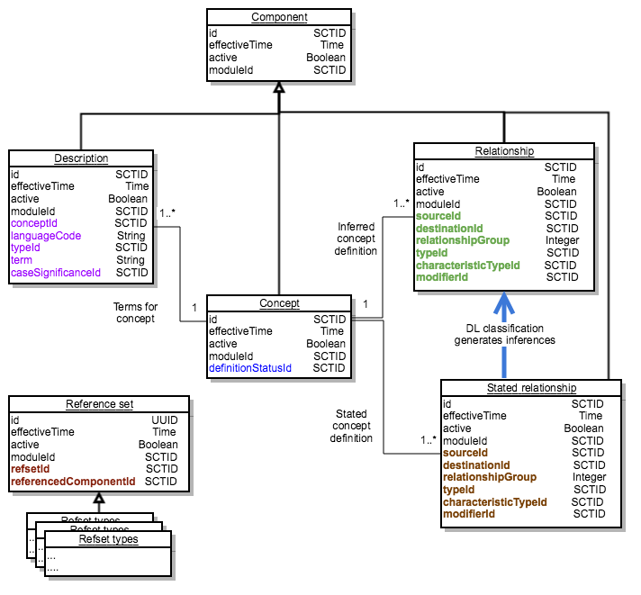

# Associations Between Release Files Prior to July 2018

The [stated relationship file](https://confluence.ihtsdotools.org/display/DOCRELFMT/stated+relationship+file), was used to represent the stated view of relationships prior to a transition process between July 2018 and July 2019. In July 2019 this file became obsolete and was completely replaced by two [OWL Expression Reference Set](../../5.2.1.9-OWL-Expression-Reference-Set_66486617.html)s (the [OWL axiom reference set file](https://confluence.ihtsdotools.org/display/DOCRELFMT/OWL+axiom+reference+set+file) and the [OWL ontology reference set file](https://confluence.ihtsdotools.org/display/DOCRELFMT/OWL+ontology+reference+set+file)).

[Figure 1](https://confluence.ihtsdotools.org/display/DOCRELFMT/Associations+Between+Release+Files+Prior+to+July+2018#Figure-assoc-2018) shows the associations between files that represent the [stated](https://confluence.ihtsdotools.org/display/DOCGLOSS/stated+view) and [inferred views](https://confluence.ihtsdotools.org/display/DOCGLOSS/inferred+view) prior to the transition. \Error: Referenced caption id not found!\\
\<b>Captions on current page:\</b>\  - Figure: with ID: \<b>assoc-2018\</b> \  shows the associations between the release files that following these changes.

The [stated relationship file](https://confluence.ihtsdotools.org/display/DOCRELFMT/stated+relationship+file) is now obsolete as it has been completely replaced by two [OWL Expression Reference Set](../../5.2.1.9-OWL-Expression-Reference-Set_66486617.html)s (the [OWL axiom reference set file](https://confluence.ihtsdotools.org/display/DOCRELFMT/OWL+axiom+reference+set+file) and the [OWL ontology reference set file](https://confluence.ihtsdotools.org/display/DOCRELFMT/OWL+ontology+reference+set+file)).

During the transitional period the [stated relationship file](https://confluence.ihtsdotools.org/display/DOCRELFMT/stated+relationship+file) continued to be distributed, but the OWL axiom reference set introduced advanced aspects to concept definitions which could not be represented in the [stated relationship file](https://confluence.ihtsdotools.org/display/DOCRELFMT/stated+relationship+file).

<figure><figcaption>
Figure 1: Associations between SNOMED CT Release Files Prior to July 2019 (now obsolete)
</figcaption></figure>
