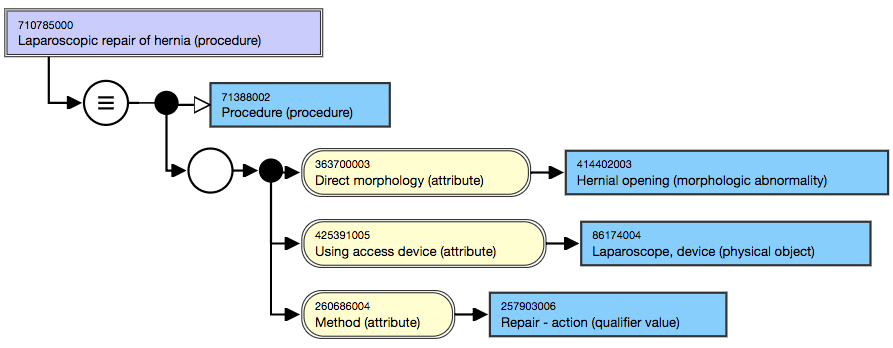

# D.2 Necessary and Sufficient - Examples

The appendix contains an extended version of [2.3.2 Necessary Conditions and Sufficient Definitions](2.3.2-Necessary-Conditions-and-Sufficient-Definitions_33490089.html) supported by more detailed examples.

# Assertions

The [stated view](https://confluence.ihtsdotools.org/display/DOCGLOSS/stated+view "Glossary link: stated view") of [concept definition](https://confluence.ihtsdotools.org/display/DOCGLOSS/concept+definition "Glossary link: concept definition") consists of one or more assertions made by [SNOMED CT authors](https://confluence.ihtsdotools.org/display/DOCGLOSS/SNOMED+CT+author "Glossary link: SNOMED CT authors"). 

# Necessary Conditions

Each time an assertion is made about a concept, an [author](https://confluence.ihtsdotools.org/display/DOCGLOSS/author "Glossary link: author") must decide if that assertion is a [necessary condition](https://confluence.ihtsdotools.org/display/DOCGLOSS/necessary+condition "Glossary link: necessary condition"). If the assertion is always true for that concept and its [subtypes](https://confluence.ihtsdotools.org/display/DOCGLOSS/subtype "Glossary link: subtypes"), it is a [necessary condition](https://confluence.ihtsdotools.org/display/DOCGLOSS/necessary+condition "Glossary link: necessary condition").

  * This implies that for all instances of that concept or its subtypes, the assertion must be true, even if it has not been explicitly stated.

* * *

A [necessary condition](https://confluence.ihtsdotools.org/display/DOCGLOSS/necessary+condition "Glossary link: necessary condition") is defined as  a characteristic that is always true of a [concept](https://confluence.ihtsdotools.org/display/DOCGLOSS/concept "Glossary link: concept"). 

### Example

  * If you have a [ 71620000 | fracture of femur|](http://snomed.info/id/71620000 "71620000 | fracture of femur |") , the morphological abnormality [ 72704001 | fracture|](http://snomed.info/id/72704001 "72704001 | fracture |") must be present. Therefore,  [ 116676008 | morphology|](http://snomed.info/id/116676008 "116676008 | morphology |") = [ 72704001 | fracture|](http://snomed.info/id/72704001 "72704001 | fracture |") is a  _necessary condition_ of [ 71620000 | fracture of femur|](http://snomed.info/id/71620000 "71620000 | fracture of femur |") .

# Sufficient Definitions

For each [concept](https://confluence.ihtsdotools.org/display/DOCGLOSS/concept "Glossary link: concept") an [author](https://confluence.ihtsdotools.org/display/DOCGLOSS/author "Glossary link: author") must decide if there are one or more sets of assertions that form a [sufficient definition](https://confluence.ihtsdotools.org/display/DOCGLOSS/sufficient+definition "Glossary link: sufficient definition") of that concept. A set of assertions is a [sufficient definition](https://confluence.ihtsdotools.org/display/DOCGLOSS/sufficient+definition "Glossary link: sufficient definition") if it distinguishes a [concept](https://confluence.ihtsdotools.org/display/DOCGLOSS/concept "Glossary link: concept") and its subtypes from other concepts. 

  * This implies that if all assertions in the set are true for a concept, it must be an instance of the defined concept or a subtype of that concept.

* * *

A [sufficient definition](https://confluence.ihtsdotools.org/display/DOCGLOSS/sufficient+definition "Glossary link: sufficient definition") is  a set of characteristics which distinguish a [concept](https://confluence.ihtsdotools.org/display/DOCGLOSS/concept "Glossary link: concept") and its [subtypes](https://confluence.ihtsdotools.org/display/DOCGLOSS/subtype "Glossary link: subtypes") from all other [concepts](https://confluence.ihtsdotools.org/display/DOCGLOSS/concept "Glossary link: concepts"). 

### Notes

  * Any concept that matches the  _sufficient definition_ is equivalent to or a [subtype](https://confluence.ihtsdotools.org/display/DOCGLOSS/subtype "Glossary link: subtype") of the defined concept.
  * A [concept](https://confluence.ihtsdotools.org/display/DOCGLOSS/concept "Glossary link: concept") may have more than one  _sufficient definition_. In that case any concept that matches at least one of these  _sufficient definitions_ is equivalent to or a [subtype](https://confluence.ihtsdotools.org/display/DOCGLOSS/subtype "Glossary link: subtype") of the defined concept.

### Examples

  * The following set of assertions is a sufficient definition for [ 74400008 | appendicitis (disorder)|](http://snomed.info/id/74400008 "74400008 | appendicitis \(disorder\) |") because any [concept](https://confluence.ihtsdotools.org/display/DOCGLOSS/concept "Glossary link: concept") for which this set of assertions is true must either be the disorder _appendicitis_ or a subtype of _appendicitis_.

[ 18526009 |disorder of appendix|](http://snomed.info/id/18526009 "18526009 | disorder of appendix |") +  
[ 302168000 |inflammation of large intestine|](http://snomed.info/id/302168000 "302168000 | inflammation of large intestine |") :  
[ 116676008 |associated morphology|](http://snomed.info/id/116676008 "116676008 | associated morphology |") =  [ 23583003 |inflammation|](http://snomed.info/id/23583003 "23583003 | inflammation |") ,  
[ 363698007 |finding site|](http://snomed.info/id/363698007 "363698007 | finding site |") =  [ 66754008 |appendix structure|](http://snomed.info/id/66754008 "66754008 | appendix structure |")

  * Both the following sets of assertions are sufficient definitions for the concept [ 8801005 | Secondary diabetes mellitus (disorder)|](http://snomed.info/id/8801005 "8801005 | Secondary diabetes mellitus \(disorder\) |") :

[ 73211009 |Diabetes mellitus|](http://snomed.info/id/73211009 "73211009 | Diabetes mellitus |") : [ 246075003 |Causative agent|](http://snomed.info/id/246075003 "246075003 | Causative agent |") = [ 105590001 |Substance|](http://snomed.info/id/105590001 "105590001 | Substance |")

[ 73211009 |Diabetes mellitus|](http://snomed.info/id/73211009 "73211009 | Diabetes mellitus |") : [ 42752001 |Due to|](http://snomed.info/id/42752001 "42752001 | Due to |") = [ 64572001 |Disease|](http://snomed.info/id/64572001 "64572001 | Disease |")

  * While each of the assertions  [ 246075003 | Causative agent|](http://snomed.info/id/246075003 "246075003 | Causative agent |") =  [ 105590001 | Substance|](http://snomed.info/id/105590001 "105590001 | Substance |") and  [ 42752001 | Due to|](http://snomed.info/id/42752001 "42752001 | Due to |") =  [ 64572001 | Disease|](http://snomed.info/id/64572001 "64572001 | Disease |") form part of a [sufficient definition](https://confluence.ihtsdotools.org/display/DOCGLOSS/sufficient+definition "Glossary link: sufficient definition"), neither of these assertions are [necessary conditions](https://confluence.ihtsdotools.org/display/DOCGLOSS/necessary+condition "Glossary link: necessary conditions") because  _only one_ of them needs to be true. This illustrates that an assertion that is part of a [sufficient definition](https://confluence.ihtsdotools.org/display/DOCGLOSS/sufficient+definition "Glossary link: sufficient definition") need not be a [necessary condition](https://confluence.ihtsdotools.org/display/DOCGLOSS/necessary+condition "Glossary link: necessary condition").

# Concepts with no Sufficient Definitions

A [concept](https://confluence.ihtsdotools.org/display/DOCGLOSS/concept "Glossary link: concept") that has no [sufficient definitions](https://confluence.ihtsdotools.org/display/DOCGLOSS/sufficient+definition "Glossary link: sufficient definitions") is a [primitive concept](https://confluence.ihtsdotools.org/display/DOCGLOSS/primitive+concept "Glossary link: primitive concept"). 

Because [primitive concepts](https://confluence.ihtsdotools.org/display/DOCGLOSS/primitive+concept "Glossary link: primitive concepts") have no [sufficient definitions](https://confluence.ihtsdotools.org/display/DOCGLOSS/sufficient+definition "Glossary link: sufficient definitions") it is not possible for a [description logic classifier](https://confluence.ihtsdotools.org/display/DOCGLOSS/description+logic+classifier "Glossary link: description logic classifier") to determine if other concepts are [subtypes](https://confluence.ihtsdotools.org/display/DOCGLOSS/subtype "Glossary link: subtypes") of this concept. Similarly, it is not possible to automatically determine whether an expression is a subtype of a primitive concept. Therefore, only concepts or expressions that explicitly state they are subtypes of primitive concepts will be treated as subtypes when applying expression constraints or undertaking analysis. 

However, note that this does not prevent a [primitive concept](https://confluence.ihtsdotools.org/display/DOCGLOSS/primitive+concept "Glossary link: primitive concept") being classified as a subtype of a [sufficiently defined concept](https://confluence.ihtsdotools.org/display/DOCGLOSS/sufficiently+defined+concept "Glossary link: sufficiently defined concept"). 

# Concepts with a Sufficient Definition

A [concept](https://confluence.ihtsdotools.org/display/DOCGLOSS/concept "Glossary link: concept") that has at least one [sufficient definition](https://confluence.ihtsdotools.org/display/DOCGLOSS/sufficient+definition "Glossary link: sufficient definition") is a [sufficiently defined concept](https://confluence.ihtsdotools.org/display/DOCGLOSS/sufficiently+defined+concept "Glossary link: sufficiently defined concept"). 

A [description logic classifier](https://confluence.ihtsdotools.org/display/DOCGLOSS/description+logic+classifier "Glossary link: description logic classifier") can determine whether the stated definitions of other concepts meet at least one of the [sufficient definitions](https://confluence.ihtsdotools.org/display/DOCGLOSS/sufficient+definition "Glossary link: sufficient definitions") and if so will classify these concepts as its [subtypes](https://confluence.ihtsdotools.org/display/DOCGLOSS/subtype "Glossary link: subtypes"). Similarly, it is possible to determine whether an expression is equivalent to or a subtype of a [sufficiently defined concept](https://confluence.ihtsdotools.org/display/DOCGLOSS/sufficiently+defined+concept "Glossary link: sufficiently defined concept"). Therefore, where expression constraints or queries refer to [sufficiently defined concepts](https://confluence.ihtsdotools.org/display/DOCGLOSS/sufficiently+defined+concept "Glossary link: sufficiently defined concepts") the results will include the inferred subtypes of these concepts.

# Sufficiently Defined Concepts with Necessary Conditions

If a [sufficiently defined concept](https://confluence.ihtsdotools.org/display/DOCGLOSS/sufficiently+defined+concept "Glossary link: sufficiently defined concept") has one or more additional [necessary conditions](https://confluence.ihtsdotools.org/display/DOCGLOSS/necessary+condition "Glossary link: necessary conditions") then any concept or expression that satisfies one of its [sufficient definitions](https://confluence.ihtsdotools.org/display/DOCGLOSS/sufficient+definition "Glossary link: sufficient definitions") will also inherit any [necessary conditions](https://confluence.ihtsdotools.org/display/DOCGLOSS/necessary+condition "Glossary link: necessary conditions").

For example one sufficient definition of [ 397825006 | Gastric ulcer (disorder)|](http://snomed.info/id/397825006 "397825006 | Gastric ulcer \(disorder\) |") is an ulcer in a stomach structure: 

===  [ 64572001 |disease|](http://snomed.info/id/64572001 "64572001 | disease |") : {  [ 116676008 |associated morphology|](http://snomed.info/id/116676008 "116676008 | associated morphology |") =  [ 56208002 |ulcer|](http://snomed.info/id/56208002 "56208002 | ulcer |") ,   
[ 363698007 |finding site|](http://snomed.info/id/363698007 "363698007 | finding site |") =  [ 69695003 |stomach structure|](http://snomed.info/id/69695003 "69695003 | stomach structure |") }

However, another definition could be created with a more specific site gastric mucosa: 

===  [ 64572001 |disease|](http://snomed.info/id/64572001 "64572001 | disease |") : {  [ 116676008 |associated morphology|](http://snomed.info/id/116676008 "116676008 | associated morphology |") =  [ 56208002 |ulcer|](http://snomed.info/id/56208002 "56208002 | ulcer |") ,   
[ 363698007 |finding site|](http://snomed.info/id/363698007 "363698007 | finding site |") =  [ 78653002 |gastric mucosa|](http://snomed.info/id/78653002 "78653002 | gastric mucosa |") }

In both cases these definition are equivalent to [ 397825006 | Gastric ulcer (disorder)|](http://snomed.info/id/397825006 "397825006 | Gastric ulcer \(disorder\) |") . The more general definition is flexible when it comes to allowing refinement to a specific location of the ulcer within the stomach, which is actually useful information. It also avoids requiring an expression to refer specifically to the mucosa (stomach lining), which is where all gastric ulcers occur.

For example, an expression including the specific location could look like this 

===  [ 64572001 |disease|](http://snomed.info/id/64572001 "64572001 | disease |") : {  [ 116676008 |associated morphology|](http://snomed.info/id/116676008 "116676008 | associated morphology |") =  [ 56208002 |ulcer|](http://snomed.info/id/56208002 "56208002 | ulcer |") ,   
[ 363698007 |finding site|](http://snomed.info/id/363698007 "363698007 | finding site |") =  [ 127869006 |Anterior wall of fundus of stomach|](http://snomed.info/id/127869006 "127869006 | Anterior wall of fundus of stomach |") }

This satisfies the sufficient definition because the finding site is a subtype of stomach structure. This will therefore classify as a type of [ 397825006 | Gastric ulcer (disorder)|](http://snomed.info/id/397825006 "397825006 | Gastric ulcer \(disorder\) |") located in the anterior wall of the gastric fundus. The problem is that a query for disorders of the gastric mucosa will not find this expression. << [ 64572001 |disease|](http://snomed.info/id/64572001 "64572001 | disease |") :  [ 363698007 |finding site|](http://snomed.info/id/363698007 "363698007 | finding site |") =  [ 78653002 |gastric mucosa|](http://snomed.info/id/78653002 "78653002 | gastric mucosa |") However, adding the definition that refers to the gastric mucosa as an additional [necessary condition](https://confluence.ihtsdotools.org/display/DOCGLOSS/necessary+condition "Glossary link: necessary condition") can solve this problem. The expression satisfies the [sufficient definition](https://confluence.ihtsdotools.org/display/DOCGLOSS/sufficient+definition "Glossary link: sufficient definition") implying this is a type of [ 397825006 | Gastric ulcer (disorder)|](http://snomed.info/id/397825006 "397825006 | Gastric ulcer \(disorder\) |") . The fact that it is a type of gastric ulcer causes it to inherit [ 363698007 | finding site|](http://snomed.info/id/363698007 "363698007 | finding site |") =  [ 78653002 | gastric mucosa|](http://snomed.info/id/78653002 "78653002 | gastric mucosa |") so it will now be included in the query for disease in the gastric mucosa.

# A Definition that is Both Necessary and Sufficient

The definition shown in [Table D.2-1](https://confluence.ihtsdotools.org/display/DOCRELFMT/D.2+Necessary+and+Sufficient+-+Examples#Table-stated-view-procedures "Stated view of the definition of |Laparoscopic repair of hernia|_CZ:_MZ:_p class_auto-cursor-target_br /_/p_table class_wrapped_colgroup span_1_col span_1 /_col span_1 /_/colgroup_tbody_tr_td class_highlight-blue colspan_1 rowspan_1 data-highlight-colour_blue_strong_Concept_/strong_/td_td class_highlight-blue colspan_1 rowspan_1 data-highlight-colour_blue_strong_Stated View of Concept Definition_/strong_/td_/tr_tr_td colspan_1 rowspan_1_div class_content-wrapper_p_MN:concept ac_schema-version_1 ac_macro-id_4288d7a5-58b4-4055-be0f-1e5ca8ac042d_ac_parameter ac_name_t_710785000 |Laparoscopic repair of hernia|_/ac_parameter_MZ:_/p_/div_/td_td colspan_1 rowspan_1_div class_content-wrapper_p class_auto-cursor-target_br /_/p_MN:scg-expression ac_schema-version_1 ac_macro-id_4a4622ab-6c24-494f-b3a4-80c08aaf03b7_ac_parameter ac_name_atlassian-macro-output-type_INLINE_/ac_parameter_CP:_ 71388002 |Procedure| _
            { 363700003 |Direct morphology| _ 414402003 |Hernial opening \(morphologic abnormality\)|, 
              425391005 |Using access device| _ 86174004 |Laparoscope, device|, 
              260686004 |Method| _ 257903006 |Repair - action| }") provides an example of a simple case.

  * The === symbol indicates that the concept definition is equivalent to the concept. 
    * This means that each of the assertions in the definition is **necessarily** true for all instance of the concept [ 710785000 | Laparoscopic repair of hernia|](http://snomed.info/id/710785000 "710785000 | Laparoscopic repair of hernia |") .
    * It also means that this definition is **sufficient** , because if all the assertions are true, this implies this is either the concept or a subtype of the concept.

  

Table D.2-1: Stated view of the definition of |Laparoscopic repair of hernia|

**Concept**| **Stated View of Concept Definition**  
---|---  
[ 710785000 | Laparoscopic repair of hernia|](http://snomed.info/id/710785000 "710785000 | Laparoscopic repair of hernia |") |  ===  [ 71388002 |Procedure|](http://snomed.info/id/71388002 "71388002 | Procedure |") :  
{  [ 363700003 |Direct morphology|](http://snomed.info/id/363700003 "363700003 | Direct morphology |") =  [ 414402003 |Hernial opening (morphologic abnormality)|](http://snomed.info/id/414402003 "414402003 | Hernial opening \(morphologic abnormality\) |") ,   
[ 425391005 |Using access device|](http://snomed.info/id/425391005 "425391005 | Using access device |") =  [ 86174004 |Laparoscope, device|](http://snomed.info/id/86174004 "86174004 | Laparoscope, device |") ,   
[ 260686004 |Method|](http://snomed.info/id/260686004 "260686004 | Method |") =  [ 257903006 |Repair - action|](http://snomed.info/id/257903006 "257903006 | Repair - action |") }  
  

<figure></figure>

# A Definition that is Necessary but Not Sufficient

The definition shown in [Table D.2-2](https://confluence.ihtsdotools.org/display/DOCRELFMT/D.2+Necessary+and+Sufficient+-+Examples#Table-stated-view-primitive "Stated view of the definition of |Acute benign pericarditis|_CZ:_MZ:_p class_auto-cursor-target_br /_/p_table class_wrapped_colgroup span_1_col span_1 /_col span_1 /_/colgroup_tbody_tr_td class_highlight-blue colspan_1 rowspan_1 data-highlight-colour_blue_strong_Concept_/strong_/td_td class_highlight-blue colspan_1 rowspan_1 data-highlight-colour_blue_strong_Stated View of Concept Definition_/strong_/td_/tr_tr_td colspan_1 rowspan_1_div class_content-wrapper_p_MN:concept ac_schema-version_1 ac_macro-id_c3a705dd-0d0a-4daf-a918-16cebef3432f_ac_parameter ac_name_t_173574009 |Acute benign pericarditis \(disorder\)|_/ac_parameter_MZ:_/p_/div_/td_td colspan_1 rowspan_1_div class_content-wrapper_p class_auto-cursor-target_br /_/p_MN:scg-expression ac_schema-version_1 ac_macro-id_6567dfeb-93bd-41ce-a0ee-4f77bac09976_ac_parameter ac_name_atlassian-macro-output-type_INLINE_/ac_parameter_CP:_ 64572001 |Disease| _
        263502005 |Clinical course| _ 424124008 |Sudden onset AND/OR short duration|
            { 116676008 |Associated morphology | _ 4532008 |Acute inflammation| , 
              363698007 |Finding site| _ 24949005 |Pericardial sac structure| }") provides an example of another simple case.

  * The <<< symbol indicates that the concept is a subtype of the concept definition. 
    * This means that each of the assertions in the definition is **necessarily** true for all instance of the concept [ 173574009 | Acute benign pericarditis (disorder)|](http://snomed.info/id/173574009 "173574009 | Acute benign pericarditis \(disorder\) |") .
    * However, this definition is **not sufficient** , because it is represent a more general meaning. Put another way, it does not capture one or more distinguishing features or the [ 173574009 | Acute benign pericarditis (disorder)|](http://snomed.info/id/173574009 "173574009 | Acute benign pericarditis \(disorder\) |") . This means that even if all the assertions are true, it may or may not be this concept or one of its subtypes.

  

Table D.2-2: Stated view of the definition of |Acute benign pericarditis|

**Concept**| **Stated View of Concept Definition**  
---|---  
[ 173574009 | Acute benign pericarditis (disorder)|](http://snomed.info/id/173574009 "173574009 | Acute benign pericarditis \(disorder\) |") |  <<< [ 64572001 |Disease|](http://snomed.info/id/64572001 "64572001 | Disease |") :  
[ 263502005 |Clinical course|](http://snomed.info/id/263502005 "263502005 | Clinical course |") =  [ 424124008 |Sudden onset AND/OR short duration|](http://snomed.info/id/424124008 "424124008 | Sudden onset AND/OR short duration |")   
{  [ 116676008 |Associated morphology|](http://snomed.info/id/116676008 "116676008 | Associated morphology |") =  [ 4532008 |Acute inflammation|](http://snomed.info/id/4532008 "4532008 | Acute inflammation |") ,   
[ 363698007 |Finding site|](http://snomed.info/id/363698007 "363698007 | Finding site |") =  [ 24949005 |Pericardial sac structure|](http://snomed.info/id/24949005 "24949005 | Pericardial sac structure |") }  
  

<figure></figure>

# A Definition that is Sufficient with Assertions that are Not Necessarily True

The definition shown in [Table D.2-3](https://confluence.ihtsdotools.org/display/DOCRELFMT/D.2+Necessary+and+Sufficient+-+Examples#Table-stated-view-secondary-dm "Possible stated view of the definition of |Secondary diabetes mellitus|_CZ:_MZ:_p class_auto-cursor-target_br /_/p_table class_wrapped_colgroup span_1_col span_1 /_col span_1 /_/colgroup_tbody_tr_td class_highlight-blue colspan_1 rowspan_1 data-highlight-colour_blue_strong_Concept_/strong_/td_td class_highlight-blue colspan_1 rowspan_1 data-highlight-colour_blue_strong_Stated View of Concept Definition_/strong_/td_/tr_tr_td colspan_1 rowspan_1_div class_content-wrapper_p_MN:concept ac_schema-version_1 ac_macro-id_6a878074-54bc-44e0-a43d-9ff70b7d24d1_ac_parameter ac_name_t_8801005 |Secondary diabetes mellitus \(disorder\)|_/ac_parameter_MZ:_/p_/div_/td_td colspan_1 rowspan_1_div class_content-wrapper_p class_auto-cursor-target_br /_/p_MN:scg-expression ac_schema-version_1 ac_macro-id_6b6cd2c6-ffb0-4939-9147-6686a1617602_ac_parameter ac_name_atlassian-macro-output-type_INLINE_/ac_parameter_CP:_73211009 |Diabetes mellitus|_
        246075003 |Causative agent| _ 763158003 |Medicinal product|
OR
_73211009 |Diabetes mellitus|_ 
        42752001 |Due to| _ 64572001 |Disease|_CZ:_MZ:_p class_auto-cursor-target_br /_/p_/div_/td_/tr_tr_td colspan_1 rowspan_1_br /_/td_td colspan_1 rowspan_1_div class_content-wrapper_p_ac_image ac_height_250_ri_attachment ri_filename_secondary_diabetes.png /_/ac_image_/p_/div_/td_/tr_/tbody_/table_p_span style_font-size_ 20.0px;_Sufficiently Defined_/span_/p_ol_li_p_MN:glossary-include ac_schema-version_1 ac_macro-id_571ebde1-5273-4a54-86fb-7e362426b9b9_ac_parameter ac_name_Gloss_sufficiently defined concept_/ac_parameter_ac_parameter ac_name_Suffix_ is _/ac_parameter_ac_parameter ac_name_Def_inline_/ac_parameter_ac_parameter ac_name_Example_true_/ac_parameter_ac_parameter ac_name_Note_true_/ac_parameter_ac_parameter ac_name_Prefix_ A _/ac_parameter_MZ:_/p_ul_li_p_ If a concept has a _em_sufficient_/em_ definition, it is possible to infer whether another concept or a  _MN:gloss ac_schema-version_1 ac_macro-id_6be9581d-1bb6-4627-aab1-90e93856832c_ac_parameter ac_name_PreSpace_false_/ac_parameter_ac_parameter ac_name_t_postcoordinated expression_/ac_parameter_MZ:_ is a  _MN:gloss ac_schema-version_1 ac_macro-id_bd3878d3-df5f-491b-9ea4-442b01b23db9_ac_parameter ac_name_PreSpace_false_/ac_parameter_ac_parameter ac_name_t_subtype_/ac_parameter_MZ:_ of, or equivalent to, that _MN:gloss ac_schema-version_1 ac_macro-id_0e23e459-5e39-4cc1-9fe3-329d8c922898_ac_parameter ac_name_PreSpace_false_/ac_parameter_ac_parameter ac_name_t_concept._/ac_parameter_MZ:_br /_br /_/p_/li_/ul_/li_li_h2_Primitive_/h2_p_MN:glossary-include ac_schema-version_1 ac_macro-id_946596cd-6ff4-4794-a395-9e42b1b45585_ac_parameter ac_name_Gloss_primitive concept_/ac_parameter_ac_parameter ac_name_Suffix_ is _/ac_parameter_ac_parameter ac_name_Def_inline_/ac_parameter_ac_parameter ac_name_Example_true_/ac_parameter_ac_parameter ac_name_Note_true_/ac_parameter_ac_parameter ac_name_Prefix_ A _/ac_parameter_MZ:_/p_/li_/ol_h1_Necessary Conditions_/h1_p_All SNOMED CT defining relationships currently released are necessarily \(always\) true for the concept defined. Relationships that are necessarily true are also know as necessary conditions._/p_p_MN:glossary-include ac_schema-version_1 ac_macro-id_0d66502d-3bfa-4beb-81c1-531258f6c0c4_ac_parameter ac_name_Gloss_necessary condition_/ac_parameter_ac_parameter ac_name_Suffix_ is defined as _/ac_parameter_ac_parameter ac_name_Def_inline_/ac_parameter_ac_parameter ac_name_Example_true_/ac_parameter_ac_parameter ac_name_Prefix_ A _/ac_parameter_MZ:_/p_h1_Sufficient Sets of Conditions_/h1_p_In practice there can be several sufficient definitions for a concept. That is to say several different ways in which a concept could be sufficiently defined by different sets of _MN:gloss ac_schema-version_1 ac_macro-id_1efd72cf-758f-42a2-996c-0a7beccbdbb6_ac_parameter ac_name_PreSpace_false_/ac_parameter_ac_parameter ac_name_t_defining relationships_/ac_parameter_MZ:_ For example_/p_p_Gastric ulcer is defined as follows_/p_MN:scg-expression ac_schema-version_1 ac_macro-id_98a97489-80f5-4174-aab6-9cb5d6ae8676_ac_parameter ac_name_atlassian-macro-output-type_INLINE_/ac_parameter_CP:397825006|gastric ulcer| 
_	 116680003 |is a| _ 64572001 |disease| 
	    { 116676008 |associated morphology| _ 56208002 |ulcer| , 
	    363698007 |finding site| _69695003 |stomach structure| }_CZ:_MZ:_p_This is a _em_sufficient_/em_ definition because any _MN:concept ac_schema-version_1 ac_macro-id_7956c10a-cbc6-41e5-9188-f30ea0b44cce_ac_parameter ac_name_t_56208002|ulcer|_/ac_parameter_ac_parameter ac_name_ShowFormat_inline_/ac_parameter_MZ:_in a _MN:concept ac_schema-version_1 ac_macro-id_2f1c09b8-3f1d-48d9-a16c-0c73591933f7_ac_parameter ac_name_t_69695003|stomach structure|_/ac_parameter_ac_parameter ac_name_ShowFormat_inline_/ac_parameter_MZ:_is by definition a _MN:concept ac_schema-version_1 ac_macro-id_4e00235c-608a-40e2-961a-759e6dac145a_ac_parameter ac_name_t_397825006|gastric ulcer|._/ac_parameter_ac_parameter ac_name_ShowFormat_inline_/ac_parameter_MZ:_Based on this definition_/p_p_Any _MN:gloss ac_schema-version_1 ac_macro-id_e9a43415-debf-449a-8628-104ae4491c99_ac_parameter ac_name_PreSpace_false_/ac_parameter_ac_parameter ac_name_t_postcoordinated expression_/ac_parameter_MZ:_ that specified a disease involving an _MN:concept ac_schema-version_1 ac_macro-id_2a66f544-f67d-447e-9d63-d1179d9afdac_ac_parameter ac_name_t_56208002|ulcer|_/ac_parameter_ac_parameter ac_name_ShowFormat_inline_/ac_parameter_MZ:_with _MN:concept ac_schema-version_1 ac_macro-id_bf7a3fe5-c0ea-46d9-ace1-b36be2981407_ac_parameter ac_name_t_363698007|finding site|_/ac_parameter_ac_parameter ac_name_ShowFormat_inline_/ac_parameter_MZ:_MN:concept ac_schema-version_1 ac_macro-id_e7ea342e-1503-400d-8289-f4539cb3c4b5_ac_parameter ac_name_t_69695003|stomach structure|_/ac_parameter_ac_parameter ac_name_ShowFormat_inline_/ac_parameter_MZ:_would be equivalent to or a _MN:gloss ac_schema-version_1 ac_macro-id_75095f9d-acc2-4337-8c4e-b601fcbb10db_ac_parameter ac_name_PreSpace_false_/ac_parameter_ac_parameter ac_name_t_subtype_/ac_parameter_MZ:_ of _MN:concept ac_schema-version_1 ac_macro-id_816068f5-cbab-4a02-9238-dbb042a7f257_ac_parameter ac_name_t_397825006|gastric ulcer|_/ac_parameter_MZ:_ _/p_p_However, a _a href_https_//confluence.ihtsdotools.org/display/WIPRELFMT/query+\(field\)_query_/a_ for all disorders involving _MN:concept ac_schema-version_1 ac_macro-id_e7ac08ad-2176-4397-b394-bf3f7fa54260_ac_parameter ac_name_t_78653002|gastric mucosa|_/ac_parameter_ac_parameter ac_name_ShowFormat_inline_/ac_parameter_MZ:_would incorrectly exclude _MN:concept ac_schema-version_1 ac_macro-id_acde87c0-4ed9-4b41-8570-044b98f65bb7_ac_parameter ac_name_t_397825006|gastric ulcer|_/ac_parameter_ac_parameter ac_name_ShowFormat_inline_/ac_parameter_MZ:_as the site is specified as _MN:concept ac_schema-version_1 ac_macro-id_a445c29b-29ed-4dea-85de-f0d20685ed6e_ac_parameter ac_name_t_78653002|gastric mucosa|_/ac_parameter_ac_parameter ac_name_ShowFormat_inline_/ac_parameter_MZ:_which is more specific than _MN:concept ac_schema-version_1 ac_macro-id_fef0f979-6381-42ba-a700-8a214ba1ed07_ac_parameter ac_name_t_69695003|stomach structure|._/ac_parameter_ac_parameter ac_name_ShowFormat_inline_/ac_parameter_MZ:_In reality there is another sufficient set defining relationships_/p_MN:scg-expression ac_schema-version_1 ac_macro-id_a90cdce3-06fa-4b64-9d61-66966bf53426_ac_parameter ac_name_atlassian-macro-output-type_INLINE_/ac_parameter_CP:397825006|gastric ulcer| 
_	 116680003 |is a| _ 64572001 |disease| 
	    { 116676008 |associated morphology| _ 56208002 |ulcer| , 
	    363698007 |finding site| _ 78653002|gastric mucosa| }") provides an example of a more complex case. 

  * The >>> symbol indicates that the concept definition represents a subtype of the concept. 
    * This means that each instance of the definition is **sufficient to represent a** subtype of the concept [ 8801005 | Secondary diabetes mellitus (disorder)|](http://snomed.info/id/8801005 "8801005 | Secondary diabetes mellitus \(disorder\) |") .
    * The definition does not represent a necessary condition, i.e. the definition is not necessarily true for all instances of the concept [ 8801005 | Secondary diabetes mellitus (disorder)|](http://snomed.info/id/8801005 "8801005 | Secondary diabetes mellitus \(disorder\) |") . Or, said in other words, not all cases of [ 8801005 | Secondary diabetes mellitus (disorder)|](http://snomed.info/id/8801005 "8801005 | Secondary diabetes mellitus \(disorder\) |") are caused by a medicinal product or a disease. 

  

Table D.2-3: Possible stated view of the definition of |Secondary diabetes mellitus|

**Concept**| **Stated View of Concept Definition**  
---|---  
[ 8801005 | Secondary diabetes mellitus (disorder)|](http://snomed.info/id/8801005 "8801005 | Secondary diabetes mellitus \(disorder\) |") |  >>> [ 73211009 |Diabetes mellitus|](http://snomed.info/id/73211009 "73211009 | Diabetes mellitus |") :  
[ 246075003 |Causative agent|](http://snomed.info/id/246075003 "246075003 | Causative agent |") =  [ 763158003 |Medicinal product|](http://snomed.info/id/763158003 "763158003 | Medicinal product |")   
OR  
>>> [ 73211009 |Diabetes mellitus|](http://snomed.info/id/73211009 "73211009 | Diabetes mellitus |") :   
[ 42752001 |Due to|](http://snomed.info/id/42752001 "42752001 | Due to |") =  [ 64572001 |Disease|](http://snomed.info/id/64572001 "64572001 | Disease |")  
  

<figure><figcaption>
Sufficiently Defined
</figcaption></figure>

  1. A [sufficiently defined concept](https://confluence.ihtsdotools.org/display/DOCGLOSS/sufficiently+defined+concept "Glossary link: sufficiently defined concept") is  a [concept](https://confluence.ihtsdotools.org/display/DOCGLOSS/concept "Glossary link: concept") with one or more [sufficient definitions](https://confluence.ihtsdotools.org/display/DOCGLOSS/sufficient+definition "Glossary link: sufficient definitions"). 

### Notes

     * A [SNOMED CT concept](https://confluence.ihtsdotools.org/display/DOCGLOSS/SNOMED+CT+concept "Glossary link: SNOMED CT concept") is expressed in a human-readable form by its [fully specified name](https://confluence.ihtsdotools.org/display/DOCGLOSS/fully+specified+name "Glossary link: fully specified name") (FSN).
     * A  _sufficiently defined concept_ has at least one [sufficient definition](https://confluence.ihtsdotools.org/display/DOCGLOSS/sufficient+definition "Glossary link: sufficient definition") that distinguishes it from any [concepts](https://confluence.ihtsdotools.org/display/DOCGLOSS/concept "Glossary link: concepts") or [expressions](https://confluence.ihtsdotools.org/display/DOCGLOSS/expression "Glossary link: expressions") that are neither equivalent to, nor subtypes of, the defined concept.

#### Examples

     * The [concept](https://confluence.ihtsdotools.org/display/DOCGLOSS/concept "Glossary link: concept") [ 74400008 | appendicitis (disorder)|](http://snomed.info/id/74400008 "74400008 | appendicitis \(disorder\) |") is  _sufficiently defined_ by the following definition because any [concept](https://confluence.ihtsdotools.org/display/DOCGLOSS/concept "Glossary link: concept") for which these defining relationships are true, is either the disorder  _appendicitis_ or a subtype of  _appendicitis_.

[ 74400008 |appendicitis (disorder)|](http://snomed.info/id/74400008 "74400008 | appendicitis \(disorder\) |")   
===  [ 18526009 |disorder of appendix|](http://snomed.info/id/18526009 "18526009 | disorder of appendix |") :  
[ 116676008 |associated morphology|](http://snomed.info/id/116676008 "116676008 | associated morphology |") =  [ 23583003 |inflammation|](http://snomed.info/id/23583003 "23583003 | inflammation |") ,  
[ 363698007 |finding site|](http://snomed.info/id/363698007 "363698007 | finding site |") =  [ 66754008 |appendix structure|](http://snomed.info/id/66754008 "66754008 | appendix structure |")

     * If a concept has a  _sufficient_ definition, it is possible to infer whether another concept or a [postcoordinated expression](https://confluence.ihtsdotools.org/display/DOCGLOSS/postcoordinated+expression "Glossary link: postcoordinated expression") is a [subtype](https://confluence.ihtsdotools.org/display/DOCGLOSS/subtype "Glossary link: subtype") of, or equivalent to, that [concept](https://confluence.ihtsdotools.org/display/DOCGLOSS/concept "Glossary link: concept").  
  

  2. ## Primitive

A [primitive concept](https://confluence.ihtsdotools.org/display/DOCGLOSS/primitive+concept "Glossary link: primitive concept") is  a [concept](https://confluence.ihtsdotools.org/display/DOCGLOSS/concept "Glossary link: concept") without a [sufficient definition](https://confluence.ihtsdotools.org/display/DOCGLOSS/sufficient+definition "Glossary link: sufficient definition") in the [necessary normal form](https://confluence.ihtsdotools.org/display/DOCGLOSS/necessary+normal+form "Glossary link: necessary normal form") distributed in the [relationship](https://confluence.ihtsdotools.org/display/DOCRELFMT/relationship+file "Reference term: relationship file"). 

### Notes

     * The meaning of a [SNOMED CT concept](https://confluence.ihtsdotools.org/display/DOCGLOSS/SNOMED+CT+concept "Glossary link: SNOMED CT concept") is expressed in a human-readable form by its [fully specified name](https://confluence.ihtsdotools.org/display/DOCGLOSS/fully+specified+name "Glossary link: fully specified name"). Each [concept](https://confluence.ihtsdotools.org/display/DOCGLOSS/concept "Glossary link: concept") also has a formal [concept definition](https://confluence.ihtsdotools.org/display/DOCGLOSS/concept+definition "Glossary link: concept definition") that provides a computer-processable representation of the meaning of the concept.

     * A  _primitive concept_ has a [concept definition](https://confluence.ihtsdotools.org/display/DOCGLOSS/concept+definition "Glossary link: concept definition") that is not sufficient to computably distinguish it from other [concepts](https://confluence.ihtsdotools.org/display/DOCGLOSS/concept "Glossary link: concepts").

### Example

     * The concept [ 5596004 | atypical appendicitis (disorder)|](http://snomed.info/id/5596004 "5596004 | atypical appendicitis \(disorder\) |") is  _primitive_ because the following definition is not sufficient to distinguish _atypical appendicitis_ from any other type of _appendicitis:_

[ 5596004 |atypical appendicitis (disorder)|](http://snomed.info/id/5596004 "5596004 | atypical appendicitis \(disorder\) |")   
<<< [ 116680003 |is a|](http://snomed.info/id/116680003 "116680003 | is a |") = [ 74400008 |appendicitis|](http://snomed.info/id/74400008 "74400008 | appendicitis |")   
[ 116676008 |associated morphology|](http://snomed.info/id/116676008 "116676008 | associated morphology |") =  [ 23583003 |inflammation|](http://snomed.info/id/23583003 "23583003 | inflammation |")   
[ 363698007 |finding site|](http://snomed.info/id/363698007 "363698007 | finding site |") =  [ 66754008 |appendix structure|](http://snomed.info/id/66754008 "66754008 | appendix structure |")

# Necessary Conditions

All SNOMED CT defining relationships currently released are necessarily (always) true for the concept defined. Relationships that are necessarily true are also know as necessary conditions.

A [necessary condition](https://confluence.ihtsdotools.org/display/DOCGLOSS/necessary+condition "Glossary link: necessary condition") is defined as  a characteristic that is always true of a [concept](https://confluence.ihtsdotools.org/display/DOCGLOSS/concept "Glossary link: concept"). 

### Example

  * If you have a [ 71620000 | fracture of femur|](http://snomed.info/id/71620000 "71620000 | fracture of femur |") , the morphological abnormality [ 72704001 | fracture|](http://snomed.info/id/72704001 "72704001 | fracture |") must be present. Therefore,  [ 116676008 | morphology|](http://snomed.info/id/116676008 "116676008 | morphology |") = [ 72704001 | fracture|](http://snomed.info/id/72704001 "72704001 | fracture |") is a  _necessary condition_ of [ 71620000 | fracture of femur|](http://snomed.info/id/71620000 "71620000 | fracture of femur |") .

# Sufficient Sets of Conditions

In practice there can be several sufficient definitions for a concept. That is to say several different ways in which a concept could be sufficiently defined by different sets of [defining relationships](https://confluence.ihtsdotools.org/display/DOCGLOSS/defining+relationship "Glossary link: defining relationships") For example:

Gastric ulcer is defined as follows: 

[ 397825006 |gastric ulcer|](http://snomed.info/id/397825006 "397825006 | gastric ulcer |")   
===  [ 116680003 |is a|](http://snomed.info/id/116680003 "116680003 | is a |") =  [ 64572001 |disease|](http://snomed.info/id/64572001 "64572001 | disease |")   
{  [ 116676008 |associated morphology|](http://snomed.info/id/116676008 "116676008 | associated morphology |") =  [ 56208002 |ulcer|](http://snomed.info/id/56208002 "56208002 | ulcer |") ,   
[ 363698007 |finding site|](http://snomed.info/id/363698007 "363698007 | finding site |") = [ 69695003 |stomach structure|](http://snomed.info/id/69695003 "69695003 | stomach structure |") }

This is a _sufficient_ definition because any [ 56208002 | ulcer|](http://snomed.info/id/56208002 "56208002 | ulcer |") in a [ 69695003 | stomach structure|](http://snomed.info/id/69695003 "69695003 | stomach structure |") is by definition a [ 397825006 | gastric ulcer|](http://snomed.info/id/397825006 "397825006 | gastric ulcer |") . Based on this definition:

Any [postcoordinated expression](https://confluence.ihtsdotools.org/display/DOCGLOSS/postcoordinated+expression "Glossary link: postcoordinated expression") that specified a disease involving an [ 56208002 | ulcer|](http://snomed.info/id/56208002 "56208002 | ulcer |") with [ 363698007 | finding site|](http://snomed.info/id/363698007 "363698007 | finding site |") [ 69695003 | stomach structure|](http://snomed.info/id/69695003 "69695003 | stomach structure |") would be equivalent to or a [subtype](https://confluence.ihtsdotools.org/display/DOCGLOSS/subtype "Glossary link: subtype") of [ 397825006 | gastric ulcer|](http://snomed.info/id/397825006 "397825006 | gastric ulcer |")

However, a [query](https://confluence.ihtsdotools.org/display/WIPRELFMT/query+\(field\)) for all disorders involving [ 78653002 | gastric mucosa|](http://snomed.info/id/78653002 "78653002 | gastric mucosa |") would incorrectly exclude [ 397825006 | gastric ulcer|](http://snomed.info/id/397825006 "397825006 | gastric ulcer |") as the site is specified as [ 78653002 | gastric mucosa|](http://snomed.info/id/78653002 "78653002 | gastric mucosa |") which is more specific than [ 69695003 | stomach structure|](http://snomed.info/id/69695003 "69695003 | stomach structure |") . In reality there is another sufficient set defining relationships 

[ 397825006 |gastric ulcer|](http://snomed.info/id/397825006 "397825006 | gastric ulcer |")   
===  [ 116680003 |is a|](http://snomed.info/id/116680003 "116680003 | is a |") =  [ 64572001 |disease|](http://snomed.info/id/64572001 "64572001 | disease |")   
{  [ 116676008 |associated morphology|](http://snomed.info/id/116676008 "116676008 | associated morphology |") =  [ 56208002 |ulcer|](http://snomed.info/id/56208002 "56208002 | ulcer |") ,   
[ 363698007 |finding site|](http://snomed.info/id/363698007 "363698007 | finding site |") =  [ 78653002 |gastric mucosa|](http://snomed.info/id/78653002 "78653002 | gastric mucosa |") }

but this is not currently represented in SNOMED CT. The reason for this is that currently the profile of description logic used by SNOMED CT does not support representation of multiple sufficient sets. 

When multiple sufficient sets are supported, satisfying a single sufficient set enables an inference to be made that all necessary conditions must also be true. For example

  * The definition [ 363698007 | finding site|](http://snomed.info/id/363698007 "363698007 | finding site |") = [ 78653002 | gastric mucosa|](http://snomed.info/id/78653002 "78653002 | gastric mucosa |") is a  _necessary_ condition for [ 397825006 | gastric ulcer|](http://snomed.info/id/397825006 "397825006 | gastric ulcer |") :

    * This is true because all gastric ulcers necessarily involve the [ 78653002 | gastric mucosa|](http://snomed.info/id/78653002 "78653002 | gastric mucosa |")

  * The definition [ 116676008 | morphology|](http://snomed.info/id/116676008 "116676008 | morphology |") = [ 56208002 | ulcer|](http://snomed.info/id/56208002 "56208002 | ulcer |") and [ 363698007 | finding site|](http://snomed.info/id/363698007 "363698007 | finding site |") = [ 69695003 | stomach structure|](http://snomed.info/id/69695003 "69695003 | stomach structure |") is a  _sufficient_ definition for [ 397825006 | gastric ulcer|](http://snomed.info/id/397825006 "397825006 | gastric ulcer |") :

    * This is true because any ulcer in a stomach structure is a [ 397825006 | gastric ulcer|](http://snomed.info/id/397825006 "397825006 | gastric ulcer |")

  * Therefore, an assertion that a person has an [ 56208002 | ulcer|](http://snomed.info/id/56208002 "56208002 | ulcer |") with [ 363698007 | finding site|](http://snomed.info/id/363698007 "363698007 | finding site |") [ 69695003 | stomach|](http://snomed.info/id/69695003 "69695003 | stomach |") is  _sufficient_ to imply that they have a [ 397825006 | gastric ulcer|](http://snomed.info/id/397825006 "397825006 | gastric ulcer |") :

    * Since a gastric ulcer  _necessarily_ involves the [ 78653002 | gastric mucosa|](http://snomed.info/id/78653002 "78653002 | gastric mucosa |") it should be possible to deduce that a person with an "ulcer" with finding site [ 69695003 | stomach|](http://snomed.info/id/69695003 "69695003 | stomach |") has a disorder of with a site [ 78653002 | gastric mucosa|](http://snomed.info/id/78653002 "78653002 | gastric mucosa |")

However, as the current profile does not enable recognition of multiple sufficient sets, the general rule is to represent the most general sufficient set as this gives the greatest coverage for subsumption testing. This approach is taken because including more defining relationships, without distinguishing them from the sufficient set means some logically equivalent expressions will not compute as equivalent to or subsumed by the defined concept. This occurs in any cases where the expression does not include one of the attributes in the definition - even if it was not part of the logically sufficient set.
