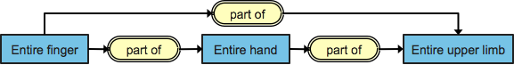

# Additional Logic Features

Several description logic features, which would improve the completeness and precision of classification, cannot be represented in individual concept definitions.


**Important Note**

The examples on this page are illustrative only. Practical requirements and benefits of representing property transitivity and chains have been established. However, the concept model rules for applying these have not yet been finalized. Therefore, one of the two examples below refers to two concepts that do not currently exist in SNOMED CT and in the other example, it is likely that transitivity will apply to a specific subtype of the general <mark style="color:blue;">|</mark>part of<mark style="color:blue;">|</mark> attribute shown in the example.


## Property Characteristics

If particular characteristics of the attributes used to define concepts are identified, this can enhance classification. For example, knowing that an attribute like 123005000 <mark style="color:blue;">|</mark>Part of<mark style="color:blue;">|</mark> is transitive would allow the classifier to make infer that an entire finger is part of the entire upper limb.

<figure><figcaption></figcaption></figure>

## Property Chains

Property chains are in some ways similar to transitivity but involve more than one attribute. For example, 127489000 <mark style="color:blue;">|</mark>Has active ingredient<mark style="color:blue;">|</mark> can be declared to chain with 738774007 <mark style="color:blue;">|</mark>Is modification of<mark style="color:blue;">|</mark>. In that case, suppose the definition of 387307005 <mark style="color:blue;">|</mark>Calcium carbonate<mark style="color:blue;">|</mark> includes 738774007 <mark style="color:blue;">|</mark>Is modification of<mark style="color:blue;">|</mark> of 5540006 <mark style="color:blue;">|</mark>Calcium<mark style="color:blue;">|</mark>, a DL classifier can determine that a tablet that 127489000 <mark style="color:blue;">|</mark>Has active ingredient<mark style="color:blue;">|</mark> = 387307005 <mark style="color:blue;">|</mark>Calcium carbonate<mark style="color:blue;">|</mark> by definition has a modification of 5540006 <mark style="color:blue;">|</mark>Calcium<mark style="color:blue;">|</mark> as its active ingredient. Thus in the example shown the classifier can determine that <mark style="color:blue;">|</mark>calcium carbonate tablet<mark style="color:blue;">|</mark> is a subtype of <mark style="color:blue;">|</mark>calcium tablet<mark style="color:blue;">|</mark>.

<figure><figcaption></figcaption></figure>
